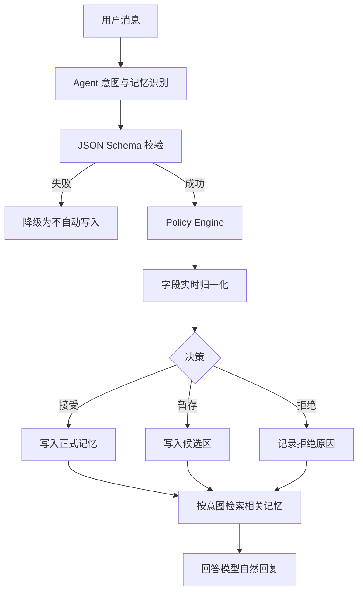

# NoteFlow 五层记忆系统详细设计说明书

> 文档版本：V1.0  
> 编写日期：2026-06-23  
> 文档状态：实施基线  
> 适用范围：NoteFlow Python 后端、Agent 编排器、聊天工作台、头像资料抽屉  
> 核心目标：让 NoteFlow 能连续对话、理解用户、记住经历、跟踪任务，同时严格隔离用户记忆与笔记知识库。

---

## 1. 文档目的

本说明书用于统一 NoteFlow 记忆系统的产品语义、系统边界、数据模型、识别流程、写入策略、检索策略、生命周期、隐私规则、接口契约、测试标准和实施顺序。

本文不是只描述“长期记忆工具”，而是定义一套完整的五层记忆体系：

1. 瞬时记忆。
2. 短期记忆。
3. 工作记忆。
4. 长期情景记忆。
5. 语义记忆（用户画像）。

本文同时解决以下现有问题：

- 用户已经说过姓名，刷新后 AI 仍然忘记。
- 用户只是自然表达个人信息，系统却要求用户再说“记住”。
- AI 在回复中暴露“长期记忆、记忆工具、已经保存”等内部机制。
- 当前打开的笔记污染普通闲聊和个人信息问答。
- 临时状态、一次性要求和稳定偏好没有清晰边界。
- 现有记忆依赖正则表达式，长尾表达覆盖不足。
- 现有记忆只保存一段文本，无法可靠更新、去重和处理冲突。
- 现有检索以关键词和重要度简单排序，无法按记忆层和意图精确取用。

---

## 2. 设计结论摘要

NoteFlow 记忆系统采用以下总体方案：

```text
五层逻辑记忆
+ 动态语义字段
+ LLM 结构化识别
+ 确定性代码裁决
+ 实时写入与异步沉淀双路径
+ 分层检索与上下文预算
+ 版本、冲突、过期和删除闭环
+ 用户可见、可改、可删
+ 笔记知识库完全独立
```

核心职责分工：

```text
LLM：理解用户表达，输出结构化候选，不直接写数据库。
Policy Engine：根据证据、稳定性、敏感度和冲突规则作最终决定。
Memory Store：分层保存、版本管理、软删除和审计。
Retriever：根据当前意图选择需要的记忆层。
Context Builder：只向回答模型提供当前真正相关的记忆。
Consolidator：异步完成摘要、归一化、去重、归档和沉淀。
```

不写死“只能记姓名、年龄、职业”等具体字段；只固定记忆层、通用类别、操作协议、安全边界和生命周期规则。

---

## 3. 当前实现基线与目标差距

### 3.1 当前已有能力

当前项目已经具备：

- `chat_sessions` 与 `chat_messages`，可以保存会话和消息。
- `agent_runs`、`agent_steps`、`agent_tool_traces`、`agent_checkpoints`，可以保存 Agent 运行状态。
- `user_memories`，保存 `memory_type`、`content`、`importance`、`confidence`、`source`、`scope` 等字段。
- `user_memory_events`，保存记忆创建、更新、删除和使用事件。
- 记忆列表、搜索、提取、创建、更新和删除接口。
- 头像资料抽屉中的基础记忆管理能力。
- 普通聊天中的静默记忆保存和记忆上下文注入。

### 3.2 当前主要限制

当前实现仍然属于单层规则版记忆：

- `extract_memory_candidates` 主要依赖正则表达式。
- `user_memories.content` 是非结构化文本，缺少 `canonical_key + value_json`。
- LLM 没有输出标准化的记忆候选协议。
- `confidence` 主要是预设数值，不能代表真实证据可靠性。
- 没有独立候选区，模糊信息只能保存或丢弃。
- 没有字段注册表和字段归一化。
- 没有情景记忆、工作记忆的独立生命周期。
- 没有实时路径与异步沉淀路径的明确分工。
- 没有系统化的同字段替换、多值合并和时态版本管理。
- 检索没有先按意图和层级硬过滤。

### 3.3 改造原则

新设计不立即删除旧表和旧接口，而采用兼容迁移：

1. 保留现有 `user_memories` 数据。
2. 新增结构化字段或新表承载五层目标模型。
3. 提供一次性迁移任务，把旧文本记忆转换为候选或结构化记忆。
4. 迁移期间旧接口返回兼容字段。
5. 新流程稳定并通过验收后，再停止旧规则提取器的主路径使用。

---

## 4. 设计目标与非目标

### 4.1 设计目标

系统必须实现：

1. 连续理解当前对话中的指代、省略和上下文。
2. 跨刷新、跨会话记住用户明确表达的稳定信息。
3. 记录具有时间意义的重要经历。
4. 跟踪多步骤任务的当前状态。
5. 自动区分稳定事实、临时状态、当前任务和笔记知识。
6. 用户无需先说“记住”，稳定个人信息也能被自动识别。
7. 正常回答不暴露内部记忆机制。
8. 新信息可以替换、补充、否定或删除旧记忆。
9. 对模型误判、解析失败和后台任务失败具备降级能力。
10. 用户能够查看、修改、停用、删除和关闭记忆功能。

### 4.2 非目标

首个完整版本不追求：

- 模拟人类心理学意义上的完整记忆系统。
- 根据用户行为频率擅自推断人格、价值观或喜好。
- 自动保存密码、身份证、银行卡、验证码等高敏感信息。
- 将每一句聊天都向量化并永久保存。
- 构建复杂知识图谱或关系图数据库。
- 为五个记忆层拆分五个独立微服务。
- 让 LLM 直接生成 SQL 或直接修改数据库。

---

## 5. 核心设计原则

### 5.1 用户原话优先

只有用户本人明确表达的信息，才有资格直接形成语义记忆。模型总结、笔记内容、检索结果和第三方信息不能冒充用户事实。

### 5.2 当前输入优先

当历史记忆与用户当前明确要求冲突时，本轮以当前输入为准。只有当前输入表达了长期更新意图，才修改长期记忆。

### 5.3 内容开放，策略固定

数据库不固定所有具体记忆字段，但固定：

- 五个记忆层级。
- 候选操作类型。
- 证据类型。
- 确定性标签。
- 稳定性标签。
- 敏感度等级。
- 状态机。
- 冲突、过期和删除规则。

### 5.4 先过滤，后检索

先根据意图、用户、层级、状态、权限和有效期限定候选集，再做相似度或相关性排序。不能把所有记忆混在一个候选池里统一排序。

### 5.5 实时路径保守，异步路径细致

实时路径只保存高确定性的明确陈述；复杂归一化、跨消息总结、情景沉淀和重复合并由异步任务完成。

### 5.6 静默使用，用户可控

普通聊天中静默保存和使用记忆，不主动说“已存入长期记忆”。但用户在个人资料区域可以完整查看、修改、删除和关闭记忆。

### 5.7 可追溯、可撤销

所有正式记忆必须能够追溯到来源消息或来源事件。更新和删除必须留下审计事件，错误记忆可以撤销或恢复。

---

## 6. 概念边界

### 6.1 用户记忆、对话状态与笔记知识

```text
用户记忆
  用户是谁、偏好什么、经历过什么、目前处于什么阶段。

对话状态
  当前聊到哪里、当前任务做到哪一步、有哪些待确认操作。

笔记知识库
  笔记正文、小节、代码片段、标题、标签和搜索索引。
```

### 6.2 隔离规则

1. 打开某篇笔记，不代表普通聊天默认检索该笔记。
2. 只有 `note_context_qa`、`note_search`、草稿生成或笔记修改等意图才读取笔记知识。
3. “我叫什么”“我最近在忙什么”只访问用户记忆，不访问笔记知识库。
4. 笔记中出现“张成、24岁、喜欢某游戏”，不能自动写入用户画像。
5. 用户说“我正在学习 SSE”可以形成用户情景或目标，但 SSE 的技术内容仍然属于笔记知识库。
6. 引用来源只用于知识回答，不用于普通用户画像回答。

### 6.3 Checkpoint 与工作记忆

二者有关联但不等价：

```text
Agent Checkpoint
  保存一次 Agent 工作流如何恢复，例如等待确认、草稿预览、修改预览。

工作记忆
  保存用户当前任务的业务状态，例如“正在修改简历，项目经历尚未完成”。
```

Checkpoint 可以作为工作记忆的技术载体之一，但工作记忆必须能够跨 Agent Run 存活，并拥有独立任务状态机。

---

## 7. 五层记忆模型

## 7.1 第一层：瞬时记忆

### 定义

瞬时记忆是单次请求执行期间的运行状态，不持久化。

### 内容

- 当前用户输入。
- 当前页面状态。
- 意图识别结果。
- 记忆读取计划。
- 记忆候选。
- 工具调用结果。
- 本轮引用来源。
- 当前流式输出状态。

### 示例

```json
{
  "run_id": "run_xxx",
  "input": "我今年24岁了",
  "intent": "personal_statement",
  "selected_note_id": null,
  "memory_read_plan": ["semantic"],
  "memory_candidates": [],
  "tool_results": []
}
```

### 生命周期

请求开始时创建，请求完成或失败后释放。需要恢复的执行状态转存为 Agent Checkpoint，而不是继续保留瞬时记忆。

### 禁止事项

- 不直接当作长期用户事实。
- 不因为出现在工具结果中就写入用户画像。
- 不在前端展示内部推理内容。

## 7.2 第二层：短期记忆

### 定义

短期记忆是当前会话最近若干轮完整消息，用于保持语言连续性。

### 主要能力

- 理解“继续”“第二个”“刚才那个方案”。
- 识别本轮省略的主语和对象。
- 保持连续追问。
- 支持页面刷新后恢复当前会话。

### 存储

复用：

- `chat_sessions`
- `chat_messages`

原始消息可以长期保留，但“短期上下文”只加载其中一个受控窗口。

### 上下文窗口策略

建议采用双限制：

```text
最近消息轮数上限：例如 12 轮。
Token 上限：例如回答模型上下文预算的 25%。
```

超过上限时：

1. 优先保留最近消息。
2. 保留仍被当前问题引用的较早消息。
3. 较早内容交给异步会话总结，不直接全部注入模型。

### 生命周期

- 当前会话内活跃。
- 会话归档后不再自动作为短期上下文加载。
- 原始聊天记录的保存期限由用户数据策略决定。

## 7.3 第三层：工作记忆

### 定义

工作记忆保存正在进行的任务、步骤、约束和待处理事项。

### 适用场景

- AI 笔记大纲生成。
- 分节正文生成。
- 正式笔记修改预览。
- 简历或学习计划的多轮完善。
- 等待用户确认的危险操作。
- 多步骤工具调用。

### 推荐结构

```json
{
  "task_type": "resume_revision",
  "title": "完善后端求职简历",
  "status": "active",
  "current_step": "project_experience",
  "completed_steps": ["basic_profile"],
  "pending_steps": ["skills", "summary"],
  "constraints": ["突出后端项目"],
  "due_at": null,
  "review_at": "2026-06-24T10:00:00",
  "related_note_id": null
}
```

### 状态机

```text
active      正在进行
paused      用户主动暂停
completed   有明确完成证据
stale       超过复查时间但完成情况未知
cancelled   用户明确取消
archived    已归档，不再参与默认检索
```

### 到期规则

`review_at` 或 `expires_at` 到达不代表任务完成：

- 定时扫描只将 `active` 转为 `stale`。
- 只有工具成功结果或用户明确陈述才能转为 `completed`。
- `stale` 不自动生成“已完成”的情景记忆。
- 用户再次提到该任务时，可以恢复为 `active`。

### 与情景记忆的关系

任务完成后，Consolidator 可以生成情景记忆：

```text
工作记忆：正在完成 SSE 学习笔记
完成证据：正式笔记已保存
情景记忆：用户于 2026-06-23 完成 SSE 学习笔记
```

## 7.4 第四层：长期情景记忆

### 定义

情景记忆记录“用户在什么时间经历过什么”，强调事件、时间和上下文。

### 适合记录

- 用户开始或结束某个阶段。
- 用户完成重要任务。
- 用户做出明确决定。
- 用户经历具有后续价值的重要事件。
- 某次长对话的高价值摘要。

### 不适合记录

- 普通寒暄。
- 每一句技术问题。
- 模型自己生成的内容。
- 无明确时间意义的稳定偏好。
- 未完成任务的虚假完成事件。

### 推荐结构

```json
{
  "event_type": "career_transition",
  "summary": "用户开始寻找后端开发工作",
  "occurred_at": "2026-06-22T00:00:00",
  "time_precision": "day",
  "importance_level": "high",
  "tags": ["求职", "后端开发"],
  "participants": ["user"],
  "source_message_ids": ["msg_xxx"]
}
```

### 时间精度

情景记忆必须记录时间精度：

```text
exact       精确时间
day         精确到日期
month       精确到月份
approximate 大致时间
unknown     用户未提供，使用记录时间但不得冒充事件时间
```

### 生命周期

- 默认长期保存。
- 低价值情景可以归档。
- 归档不等于删除。
- 用户删除来源会话时，依据产品数据策略决定是否级联删除对应情景。

## 7.5 第五层：语义记忆

### 定义

语义记忆保存相对稳定、可复用的用户事实、偏好、目标和约束。

### 推荐通用类别

类别是受控的宽泛分类，不限制具体字段：

```text
identity       姓名、称呼、身份
profile        年龄、生日、所在地、教育等资料
relationship   用户主动表达并允许保存的重要关系
career         职业状态、目标岗位、工作方向
interest       兴趣爱好
preference     内容、交互和产品偏好
communication  回答语言、长短、语气和格式偏好
habit          稳定习惯和工作方式
goal           中长期目标
constraint     长期限制和禁忌
skill          用户明确陈述的技能与学习方向
project        用户长期参与的项目背景
custom         暂时无法归入标准类别的长尾事实
```

### 动态字段示例

```json
{
  "category": "habit",
  "canonical_key": "coding.planning_method",
  "value_json": {"method": "写代码前先画流程图"}
}
```

数据库不需要预先拥有 `planning_method` 列。

### 单值、多值和时态字段

```text
单值字段：姓名、当前所在地、当前职业状态。
多值字段：兴趣、技能、常用技术方向。
时态字段：年龄、职业阶段、当前目标。
```

字段注册表必须定义其基数和冲突策略。

### 年龄的特殊处理

用户说“我今年24岁了”时保存：

```json
{
  "canonical_key": "profile.age",
  "value_json": {"age": 24, "stated_at": "2026-06-23"}
}
```

没有生日时不能自动按年份永久加一。未来回答应表达为“你之前说当时24岁”，或在用户提供生日后改为基于生日计算年龄。

---

## 8. 统一记忆候选协议

### 8.1 LLM 输出职责

Memory Recognizer 只输出候选，不执行数据库操作。输出必须通过严格 JSON Schema 校验。

### 8.2 候选结构

```json
{
  "intent": "personal_statement",
  "read_plan": ["semantic"],
  "candidates": [
    {
      "operation": "upsert",
      "target_layer": "semantic",
      "category": "interest",
      "proposed_key": "interest.favorite_game",
      "value": {"name": "率土之滨"},
      "display_summary": "用户喜欢玩率土之滨",
      "source_subject": "user",
      "evidence_type": "user_first_person",
      "certainty": "explicit",
      "modality": "assertion",
      "stability": "long_term",
      "sensitivity": "normal",
      "temporal": {
        "valid_from": null,
        "valid_to": null,
        "time_precision": "unknown"
      },
      "source_span": "我喜欢玩率土之滨"
    }
  ]
}
```

### 8.3 固定枚举

```text
operation:
  create / upsert / replace / append / remove / invalidate / noop

target_layer:
  working / episodic / semantic / none

evidence_type:
  user_first_person / user_explicit_command / third_party / model_inference /
  note_content / tool_result / unknown

certainty:
  explicit / probable / uncertain / negated

modality:
  assertion / preference / intention / question / hypothesis / quotation

stability:
  transient / session / task / medium_term / long_term / unknown

sensitivity:
  normal / personal / sensitive / highly_sensitive
```

### 8.4 不使用 LLM 自报置信分

LLM 不输出 `confidence: 0.97` 作为最终写入依据。系统根据结构化证据标签计算策略结果。

示例：

```text
用户第一人称 + 明确陈述 + 长期稳定 + 普通敏感度
→ 可实时写入。

第一人称 + “可能、好像、也许”
→ 进入候选区或仅保留短期上下文。

第三方信息或模型推断
→ 不写入用户语义记忆。
```

---

## 9. 实时处理路径

### 9.1 触发时机

每条用户消息进入 Agent 后执行一次轻量结构化识别。该识别可以与意图路由合并为一次模型调用，避免重复增加延迟。

### 9.2 实时流程



### 9.3 实时允许直接写入的情况

- 用户明确陈述自己的姓名或称呼。
- 用户明确陈述稳定兴趣或偏好。
- 用户明确陈述职业状态或中长期目标。
- 用户明确表达长期交互约束。
- 用户明确要求记住、修改或忘记某项信息。
- 工具返回确定的任务完成结果，可更新工作记忆。

### 9.4 实时不直接写入的情况

- 含“可能、也许、好像”等不确定表达。
- 仅通过提问或行为频率推断出的偏好。
- 第三方个人信息。
- 从笔记或检索片段中发现的信息。
- 模型自行推断的性格、身份和动机。
- 需要跨多轮才能判断的隐含模式。
- 高敏感信息。

### 9.5 回答时序

正式记忆写入应在回答生成前完成或与回答准备并行，但不能因为后台沉淀失败阻塞普通回答。

用户说“我叫张成”后，下一轮“我叫什么”必须能够立即读到姓名。

---

## 10. 异步沉淀路径

### 10.1 触发条件

- 会话在设定时间内无新消息。
- 会话被用户归档。
- 工作任务完成、取消或长期过期。
- 候选记忆积累达到阈值。
- 系统定时维护任务启动。

### 10.2 异步职责

1. 生成高价值会话情景摘要。
2. 处理 `pending` 候选。
3. 合并同义字段。
4. 聚类重复情景。
5. 检查新旧记忆冲突。
6. 将完成的工作记忆沉淀为情景记忆。
7. 将低价值或过期项目归档。
8. 生成检索索引。

### 10.3 禁止事项

- 不因为用户频繁询问某知识就推断为长期偏好。
- 不从助手回复中提取用户事实。
- 不将未完成任务总结为已完成事件。
- 不在缺乏证据时把多个弱候选合成为确定事实。
- 不修改没有来源追踪的正式记忆。

### 10.4 失败策略

- 异步任务失败不影响聊天主流程。
- 候选保留为 `pending` 并记录重试次数。
- 连续失败后转为 `failed`，等待人工排查或下一次维护任务。
- 同一个会话总结任务必须幂等，避免重复生成情景记忆。

---

## 11. Policy Engine 确定性裁决

### 11.1 输入

- 结构化候选。
- 用户记忆开关与隐私设置。
- 字段注册定义。
- 当前正式记忆。
- 来源消息与会话。
- 当前时间。

### 11.2 输出

```json
{
  "decision": "accept",
  "normalized_key": "interest.favorite_game",
  "normalized_value": {"name": "率土之滨"},
  "target_status": "active",
  "conflict_action": "append",
  "reason_code": "EXPLICIT_FIRST_PERSON_STABLE"
}
```

### 11.3 决策顺序

```text
1. 用户是否开启记忆功能。
2. 来源主体是否为当前用户。
3. 是否为问题、假设、引用或否定表达。
4. 是否属于高敏感内容。
5. 稳定性是否符合目标层级。
6. 是否能够归一到已有字段。
7. 是否与现有记忆冲突。
8. 字段基数和更新策略是什么。
9. 接受、暂存、拒绝或执行删除。
```

### 11.4 证据强度映射

| 证据 | 处理 |
|---|---|
| 用户明确记忆命令 | 最高优先级，但仍受隐私策略限制 |
| 用户第一人称明确陈述 | 可以自动保存 |
| 用户第一人称弱确定陈述 | 候选区或短期记忆 |
| 工具确定结果 | 可更新对应工作记忆 |
| 用户行为频率 | 只能形成低级情景线索，不能形成偏好 |
| 第三方信息 | 不写入用户画像 |
| 笔记内容 | 仅进入知识库 |
| 模型推断 | 不直接形成正式记忆 |

### 11.5 重要性

`importance` 不由 LLM 任意打分，采用字段默认权重与有限修正：

```text
身份、长期约束、长期目标：高。
稳定偏好、职业状态：中高。
普通兴趣、工作习惯：中。
一般情景：中低。
临时状态：不进入长期记忆。
```

情景记忆可根据是否影响未来任务、是否由用户强调、是否为任务完成事件进行有限升降级。

### 11.6 标准拒绝原因

```text
MEMORY_DISABLED
NOT_USER_SUBJECT
QUESTION_NOT_ASSERTION
UNCERTAIN_STATEMENT
TRANSIENT_ONLY
NOTE_KNOWLEDGE_ONLY
MODEL_INFERENCE_ONLY
HIGHLY_SENSITIVE
INVALID_SCHEMA
DUPLICATE_NO_CHANGE
INSUFFICIENT_EVIDENCE
```

---

## 12. 字段注册与归一化

### 12.1 为什么需要注册表

完全自由的 `canonical_key` 会产生：

```text
favorite_game
liked_game
game_preference
preferred_game
```

字段注册表用于管理标准字段、别名、值类型、基数、冲突策略、敏感等级和默认重要性。

### 12.2 注册表示例

```json
{
  "category": "interest",
  "canonical_key": "interest.favorite_game",
  "aliases": ["liked_game", "preferred_game", "game_preference"],
  "value_type": "object",
  "cardinality": "multiple",
  "conflict_policy": "merge_set",
  "sensitivity": "normal",
  "default_importance": "medium"
}
```

### 12.3 实时归一化

实时路径按以下顺序处理：

1. 精确匹配标准字段。
2. 匹配字段别名。
3. 在同一类别中做规范化文本匹配。
4. 对高频字段使用小型规则词典。
5. 无法可靠匹配时进入候选区，不在实时路径创建大量新字段。

### 12.4 异步归一化

长尾字段在异步任务中：

1. 检索同类别已有字段。
2. 使用关键词与语义相似度生成少量候选。
3. 批量交给 LLM 判断是否同义。
4. 同义则绑定已有字段。
5. 确属新概念时创建字段注册项。
6. 对误创建字段执行合并迁移。

### 12.5 候选状态

```text
pending     等待处理
accepted    已转为正式记忆
rejected    已拒绝
merged      已合并至其他候选或正式记忆
failed      处理失败
```

候选记忆默认不参与回答，不展示在普通记忆列表中。

### 12.6 长尾字段原则

允许长尾，不允许无序：

- 内容可以开放。
- 类别必须受控。
- 字段必须有规范名称。
- 值必须符合注册的数据类型。
- 每个字段必须有基数和冲突策略。
- 新字段创建必须有来源证据和审计记录。

---

## 13. 冲突、更新与版本管理

### 13.1 冲突类型

```text
值冲突：姓名从 A 变为 B。
状态冲突：求职中变为已入职。
时间冲突：用户说的年龄与生日计算结果不一致。
偏好冲突：喜欢详细回答，同时又说偏好简洁。
来源冲突：用户本人陈述与笔记内容不一致。
当前要求冲突：长期偏好简洁，本轮要求详细。
```

### 13.2 字段级冲突策略

字段注册表定义：

```text
replace_single
  单值替换。适用于姓名、当前所在地、当前职业状态。

merge_set
  多值集合合并。适用于兴趣、技能。

append_version
  保留时态版本。适用于年龄陈述、职业阶段、长期目标。

override_current_turn
  只在当前请求覆盖，不修改长期记忆。适用于写作风格和回答长度。

manual_only
  必须用户明确确认才更新。适用于敏感或高风险资料。
```

### 13.3 单值替换

用户说“以后叫我小成”：

1. 旧称呼记录设置 `valid_to`。
2. 旧记录状态设置为 `superseded`。
3. 新记录设置为 `active`。
4. 新记录通过 `supersedes_id` 指向旧记录。
5. 写入一条 `superseded` 审计事件。

不能让两个互斥称呼同时作为当前主称呼参与回答。

### 13.4 多值增删

用户说“我喜欢率土之滨，也喜欢文明 6”：

- 可以保存两个独立值，或保存为规范化集合。
- 用户说“不玩率土之滨了”时只失效对应值。
- 不能把“不玩了”新增成另一条兴趣文本。

### 13.5 当前请求覆盖

```text
长期偏好：回答简洁。
当前要求：这次详细讲一下。
```

本轮详细回答，但不修改长期偏好。只有“以后都详细一点”才产生长期更新候选。

### 13.6 否定与删除

```text
“我不叫张成”
  失效姓名张成，但不能凭空创建新姓名。

“忘掉我的名字”
  删除或失效姓名相关正式记忆。

“我不喜欢这个游戏了”
  根据短期上下文解析“这个游戏”，失效对应兴趣。
```

删除必须先解析目标范围，目标不明确时不能批量删除。

### 13.7 幂等性

同一来源消息、同一字段、同一规范值只能产生一次正式写入。建议使用：

```text
dedupe_key = hash(user_id + source_message_id + canonical_key + normalized_value)
```

异步任务重试时必须复用相同幂等键。

---

## 14. 记忆读取与检索调度

### 14.1 Memory Read Plan

Agent 路由器对每次请求输出读取计划：

```json
{
  "intent": "memory_query",
  "layers": ["semantic"],
  "categories": ["identity", "profile"],
  "keys": ["identity.name"],
  "include_note_knowledge": false,
  "include_current_note": false
}
```

### 14.2 常见意图映射

| 用户输入 | 读取层 | 是否读取笔记 |
|---|---|---|
| 我叫什么 | 语义 | 否 |
| 我最近在忙什么 | 情景、工作 | 否 |
| 刚才说到哪了 | 短期 | 否 |
| 简历修改到哪一步了 | 工作、短期 | 否 |
| 结合我的情况规划求职 | 语义、情景、工作 | 仅明确需要时 |
| SSE 是什么 | 无用户记忆或仅交互偏好 | 是 |
| 当前笔记讲了什么 | 短期、当前笔记 | 是 |
| 你好 | 通常不读取任何长期记忆 | 否 |

### 14.3 分层专用检索

#### 短期记忆

按会话和时间读取，附加指代关联，不做全局语义搜索。

#### 工作记忆

按 `user_id + status + task_type + related_resource` 查询，优先 `active`，其次当前问题明确提到的 `paused/stale`。

#### 语义记忆

优先级：

```text
精确 canonical_key
→ 字段别名
→ 类别过滤后的文本或语义匹配
```

姓名、年龄等明确字段不应依赖向量召回。

#### 情景记忆

采用混合召回：

- 关键词匹配。
- 标签匹配。
- 时间范围过滤。
- 语义相似度。
- 相关实体匹配。

项目当前没有向量基础设施时，第一版先使用关键词、标签和时间过滤，并预留 `embedding_ref`；后续接入向量索引适配器，不把向量实现写死在业务服务中。

### 14.4 排序公式

必须先硬过滤，再排序。情景候选的参考公式：

```text
base_relevance = hybrid_retrieval_score
importance_factor = 0.75 + 0.25 × normalized_importance
time_factor = 0.70 + 0.30 × time_decay
evidence_factor = 0.80 + 0.20 × evidence_strength

final_score = base_relevance
              × importance_factor
              × time_factor
              × evidence_factor
```

修正因子设置下限，避免“很早但非常重要”的记忆完全消失。明确字段查询不套用该公式，直接按有效版本返回。

### 14.5 时间衰减

时间衰减只影响检索排序，不自动删除记忆：

```text
语义事实：通常不衰减，只看是否有效。
工作记忆：按状态与更新时间强衰减。
情景记忆：普通事件衰减，重要事件衰减较慢。
短期记忆：按上下文窗口自然淘汰。
```

### 14.6 上下文预算

Context Builder 必须设置每层预算，不能把所有记忆塞给回答模型。参考配置：

```text
短期消息：上下文预算 25%。
工作记忆：最多 2 个相关任务。
语义记忆：最多 6 条相关事实。
情景记忆：最多 4 条相关事件。
笔记知识：由 RAG 独立控制片段数量。
```

最终按请求复杂度动态调整，但用户当前输入始终保留完整。

### 14.7 注入格式

内部上下文使用结构化、低诱导格式：

```text
[User facts]
- preferred_name: 张成
- answer_style: 简洁直接

[Active tasks]
- 完善后端求职简历；当前步骤：项目经历

[Relevant episodes]
- 2026-06-22：开始寻找后端开发工作
```

系统提示必须声明：

- 这些内容只作为背景，不要主动逐条复述。
- 当前输入优先。
- 不要说“根据长期记忆”。
- 不要把不确定或过期内容当成确定事实。

### 14.8 无结果行为

没有相关记忆时自然回答，不要输出：

```text
没有在长期记忆中查到……
记忆工具未返回结果……
你可以告诉我并让我保存……
```

用户明确问“你记得我的年龄吗”时，可以自然说“你之前还没有告诉我”，但不暴露工具和数据库概念。

---

## 15. 生命周期、过期、遗忘与删除

### 15.1 生命周期总览

| 层级 | 创建 | 活跃 | 结束 |
|---|---|---|---|
| 瞬时 | 请求开始 | Agent 执行期间 | 请求结束释放 |
| 短期 | 消息写入 | 当前会话 | 会话归档后退出默认窗口 |
| 工作 | 创建任务 | active/paused | completed/stale/cancelled/archived |
| 情景 | 实时重要事件或异步总结 | active | archived/deleted |
| 语义 | 明确稳定事实 | active | superseded/archived/deleted |

### 15.2 归档与删除区别

```text
archived
  不参与默认检索，但保留历史和审计。

superseded
  被新版本替代，历史查询可用。

deleted
  用户要求删除，不再参与任何模型上下文。
```

### 15.3 用户删除

用户可以：

- 删除单条记忆。
- 删除某一类别。
- 清空全部用户记忆。
- 清空对话记录。
- 关闭自动记忆。

删除后必须立即停止检索使用，后台索引需要同步清除。审计事件只能保留必要的操作元数据，不应继续保存已删除的敏感正文。

### 15.4 关闭记忆功能

推荐提供两个独立开关：

```text
允许自动形成新记忆。
允许在回答中使用已有记忆。
```

用户关闭后：

- 不再自动创建候选和正式记忆。
- 不向回答模型注入已有用户记忆。
- 原有数据保留，除非用户选择删除。
- 短期会话连续性仍可根据聊天功能设置保留。

---

## 16. 数据模型设计

### 16.1 总体策略

采用“共享字段规范 + 分层专用表”：

```text
瞬时记忆：不入库。
短期记忆：复用 chat_sessions / chat_messages。
工作记忆：user_working_memories。
情景记忆：user_episodic_memories。
语义记忆：user_semantic_memories。
候选：user_memory_candidates。
字段注册：memory_field_definitions。
审计：user_memory_events 扩展。
```

不建议把所有层全部塞入同一张 EAV 表，因为它们的状态机、检索方式和索引需求不同。

### 16.2 共享字段规范

正式记忆通用字段：

```text
id
user_id
category
summary
source_type
source_session_id
source_message_id
status
created_at
updated_at
deleted_at
```

### 16.3 memory_field_definitions

```sql
CREATE TABLE memory_field_definitions (
    id VARCHAR(64) PRIMARY KEY,
    category VARCHAR(50) NOT NULL,
    canonical_key VARCHAR(160) NOT NULL UNIQUE,
    display_name VARCHAR(120) NOT NULL,
    value_type VARCHAR(30) NOT NULL,
    cardinality VARCHAR(20) NOT NULL,
    conflict_policy VARCHAR(40) NOT NULL,
    sensitivity_level VARCHAR(30) NOT NULL,
    default_importance VARCHAR(20) NOT NULL,
    aliases JSON NOT NULL,
    schema_json JSON,
    status VARCHAR(30) NOT NULL DEFAULT 'active',
    created_at DATETIME NOT NULL,
    updated_at DATETIME NOT NULL
);
```

### 16.4 user_semantic_memories

```sql
CREATE TABLE user_semantic_memories (
    id VARCHAR(64) PRIMARY KEY,
    user_id VARCHAR(64) NOT NULL,
    category VARCHAR(50) NOT NULL,
    canonical_key VARCHAR(160) NOT NULL,
    value_json JSON NOT NULL,
    display_summary TEXT NOT NULL,
    evidence_type VARCHAR(50) NOT NULL,
    certainty VARCHAR(30) NOT NULL,
    sensitivity_level VARCHAR(30) NOT NULL,
    importance_level VARCHAR(20) NOT NULL,
    valid_from DATETIME,
    valid_to DATETIME,
    status VARCHAR(30) NOT NULL DEFAULT 'active',
    supersedes_id VARCHAR(64),
    source_session_id VARCHAR(64),
    source_message_id VARCHAR(64),
    dedupe_key VARCHAR(128) NOT NULL,
    last_used_at DATETIME,
    access_count INT NOT NULL DEFAULT 0,
    created_at DATETIME NOT NULL,
    updated_at DATETIME NOT NULL,
    deleted_at DATETIME,
    INDEX idx_semantic_user_key_status
      (user_id, canonical_key, status),
    UNIQUE KEY uq_semantic_dedupe (dedupe_key)
);
```

### 16.5 user_episodic_memories

```sql
CREATE TABLE user_episodic_memories (
    id VARCHAR(64) PRIMARY KEY,
    user_id VARCHAR(64) NOT NULL,
    event_type VARCHAR(80) NOT NULL,
    summary TEXT NOT NULL,
    details_json JSON,
    occurred_at DATETIME,
    occurred_end_at DATETIME,
    time_precision VARCHAR(30) NOT NULL,
    importance_level VARCHAR(20) NOT NULL,
    evidence_type VARCHAR(50) NOT NULL,
    tags JSON NOT NULL,
    source_session_id VARCHAR(64),
    source_message_ids JSON NOT NULL,
    related_note_ids JSON NOT NULL,
    embedding_ref VARCHAR(255),
    status VARCHAR(30) NOT NULL DEFAULT 'active',
    dedupe_key VARCHAR(128) NOT NULL,
    last_used_at DATETIME,
    access_count INT NOT NULL DEFAULT 0,
    created_at DATETIME NOT NULL,
    updated_at DATETIME NOT NULL,
    deleted_at DATETIME,
    INDEX idx_episode_user_time_status
      (user_id, occurred_at, status),
    UNIQUE KEY uq_episode_dedupe (dedupe_key)
);
```

### 16.6 user_working_memories

```sql
CREATE TABLE user_working_memories (
    id VARCHAR(64) PRIMARY KEY,
    user_id VARCHAR(64) NOT NULL,
    session_id VARCHAR(64),
    task_type VARCHAR(80) NOT NULL,
    title VARCHAR(255) NOT NULL,
    state_json JSON NOT NULL,
    current_step VARCHAR(160),
    status VARCHAR(30) NOT NULL DEFAULT 'active',
    related_note_id VARCHAR(64),
    related_draft_id VARCHAR(64),
    checkpoint_id VARCHAR(64),
    due_at DATETIME,
    review_at DATETIME,
    completed_at DATETIME,
    cancelled_at DATETIME,
    created_at DATETIME NOT NULL,
    updated_at DATETIME NOT NULL,
    INDEX idx_working_user_status
      (user_id, status, updated_at)
);
```

### 16.7 user_memory_candidates

```sql
CREATE TABLE user_memory_candidates (
    id VARCHAR(64) PRIMARY KEY,
    user_id VARCHAR(64) NOT NULL,
    target_layer VARCHAR(30) NOT NULL,
    category VARCHAR(50),
    proposed_key VARCHAR(160),
    value_json JSON,
    display_summary TEXT,
    evidence_type VARCHAR(50) NOT NULL,
    certainty VARCHAR(30) NOT NULL,
    modality VARCHAR(30) NOT NULL,
    stability VARCHAR(30) NOT NULL,
    sensitivity_level VARCHAR(30) NOT NULL,
    source_span TEXT,
    source_session_id VARCHAR(64),
    source_message_id VARCHAR(64),
    status VARCHAR(30) NOT NULL DEFAULT 'pending',
    decision_reason VARCHAR(80),
    resolved_memory_id VARCHAR(64),
    retry_count INT NOT NULL DEFAULT 0,
    created_at DATETIME NOT NULL,
    resolved_at DATETIME,
    INDEX idx_candidate_status
      (status, created_at)
);
```

### 16.8 user_memory_events 扩展

建议扩展为：

```text
memory_layer
target_id
event_type
old_value_json
new_value_json
reason_code
source_message_id
actor_type
metadata_json
created_at
```

事件类型：

```text
candidate_created / accepted / rejected / merged
created / updated / superseded / invalidated
archived / restored / deleted / used
work_started / paused / resumed / completed / stale / cancelled
```

### 16.9 用户记忆设置

新增服务端设置，不能只存在浏览器本地：

```text
auto_memory_enabled
memory_retrieval_enabled
sensitive_memory_mode
conversation_retention_mode
episodic_consolidation_enabled
```

### 16.10 外键与用户隔离

- 所有用户记忆表必须使用服务端认证上下文中的 `user_id`。
- API 不接受客户端传入任意 `user_id`。
- 所有查询必须包含 `user_id` 条件。
- 删除用户账号时按数据策略级联删除记忆与索引。
- 当前项目用户 ID 为 `String(64)`，新表保持一致。

---

## 17. 服务模块设计

建议将当前 `services/memory.py` 拆分为以下模块：

```text
memory_recognizer.py
  调用 LLM，验证结构化输出。

memory_policy.py
  证据、稳定性、敏感度、冲突和写入决策。

memory_normalizer.py
  字段注册、别名匹配和长尾候选处理。

memory_store.py
  语义、情景、工作记忆的 CRUD 与版本事务。

memory_retriever.py
  分层检索、排序和使用计数。

memory_context.py
  上下文预算与模型注入格式。

memory_consolidator.py
  会话摘要、候选归一化、去重和工作任务沉淀。

memory_expiration.py
  工作记忆复查、过期和归档。

memory_audit.py
  统一审计事件。
```

初期可以仍处于同一 Python 包内，不拆微服务。

---

## 18. API 与内部工具协议

### 18.1 用户管理接口

```text
GET    /api/memories/semantic
GET    /api/memories/episodes
GET    /api/memories/working
GET    /api/memories/settings
PUT    /api/memories/settings
PUT    /api/memories/semantic/{id}
DELETE /api/memories/semantic/{id}
DELETE /api/memories/episodes/{id}
PUT    /api/memories/working/{id}
DELETE /api/memories/all
```

### 18.2 Agent 内部工具

```text
memory.recognize
memory.apply_candidates
memory.search
memory.get_profile
memory.get_active_work
memory.create_work
memory.update_work
memory.forget
memory.consolidate_session
```

内部工具参数不允许包含可替换认证上下文的 `user_id`。

### 18.3 识别接口返回

```json
{
  "intent": "personal_statement",
  "readPlan": {
    "layers": ["semantic"],
    "includeNoteKnowledge": false
  },
  "candidates": [],
  "warnings": []
}
```

### 18.4 应用候选返回

```json
{
  "accepted": ["candidate_1"],
  "pending": [],
  "rejected": [],
  "operations": [
    {
      "type": "semantic_upsert",
      "memoryId": "memory_1",
      "reasonCode": "EXPLICIT_FIRST_PERSON_STABLE"
    }
  ]
}
```

这些结果默认只供后端编排和调试，不直接展示在聊天气泡中。

### 18.5 兼容接口

迁移期间保留：

```text
GET    /api/memories
POST   /api/memories/search
POST   /api/memories/extract
POST   /api/memories
PUT    /api/memories/{id}
DELETE /api/memories/{id}
```

兼容层将新结构映射为旧的 `memoryType/content/status`，但新功能不继续依赖旧文本模型。

---

## 19. Agent 编排集成

### 19.1 推荐执行顺序

```text
1. 保存用户消息。
2. 构建瞬时运行状态。
3. Agent 输出 intent + read_plan + memory_candidates。
4. 校验候选结构。
5. Policy Engine 应用可实时处理的候选。
6. 根据 read_plan 分层检索。
7. 只有知识意图才调用笔记 RAG。
8. Context Builder 组装上下文。
9. 回答模型生成自然回复。
10. 保存助手消息和运行结果。
11. 满足条件时投递异步沉淀任务。
```

### 19.2 普通问候

“你好”应走 `general_chat`：

- 不默认检索当前笔记。
- 不默认展开用户全部画像。
- 不产生情景或语义记忆。
- 使用模型自然回答，不能返回写死模板。

### 19.3 个人陈述

“我今年24岁了”：

- 意图为 `personal_statement`。
- 不读取当前笔记。
- 生成年龄候选。
- 代码校验并实时保存。
- 自然回应当前表达，不提保存动作。

### 19.4 记忆查询

“你还记得我多大了吗”：

- 意图为 `memory_query`。
- 精确读取 `profile.age` 当前有效记录。
- 不调用笔记检索。
- 自然回答年龄及必要的时间限定。

### 19.5 知识问答

“缓存雪崩是什么”：

- 意图为 `note_search` 或通用知识问答。
- 笔记检索与联网能力由知识路由决定。
- 用户记忆最多读取表达偏好，不读取无关姓名、年龄和情景。
- 引用标记只对应知识来源。

### 19.6 工具轨迹

静默记忆识别、读取和写入可以记录到服务端 Tool Trace，但前端默认过滤 `metadata.silent = true`。只有调试模式或用户主动查看运行详情时才展示技术轨迹。

---

## 20. 前端产品设计

### 20.1 入口

记忆管理不建立独立页面，放在头像区域的个人资料抽屉中，符合 NoteFlow 单工作台方向。

### 20.2 展示分组

```text
个人资料
  姓名、称呼、所在地、职业状态等语义记忆。

兴趣与偏好
  兴趣、回答方式、写作风格和长期约束。

目标与项目
  长期目标、学习方向和项目背景。

最近经历
  情景记忆时间线。

进行中的任务
  active / paused / stale 工作记忆。
```

短期消息不在“用户画像”中展示，仍然属于聊天记录。

### 20.3 单条操作

- 编辑。
- 删除。
- 停用或恢复。
- 查看来源时间。
- 对工作任务执行继续、暂停、完成或取消。

默认不展示模型置信度、字段 key 和内部策略码。

### 20.4 聊天表现

禁止在普通回答中出现：

```text
你的名字已经存在我的长期记忆里。
我已将这条信息存入记忆。
如果希望保存，可以告诉我。
根据记忆工具查询结果。
执行轨迹：记忆完成。
```

用户明确问“你记得我什么”时，可以列出自然语言资料，但仍不需要暴露数据库字段和内部工具名。

---

## 21. 隐私与安全

### 21.1 敏感等级

```text
normal
  普通兴趣、交互偏好、公开技能。

personal
  姓名、年龄、所在地、职业状态。

sensitive
  健康、财务状况、亲密关系、政治宗教等。

highly_sensitive
  密码、验证码、证件号码、银行卡、密钥、精确认证信息。
```

### 21.2 保存策略

- `normal`：符合证据和稳定性规则时可以自动保存。
- `personal`：可以自动保存，但必须可见、可改、可删。
- `sensitive`：默认不自动沉淀为正式语义记忆，除非用户明确要求且设置允许。
- `highly_sensitive`：拒绝保存，候选正文也不应长期保留。

### 21.3 数据最小化

- 只保存未来确实有复用价值的信息。
- 来源片段只保存必要范围。
- 不复制整段聊天到语义记忆。
- 异步任务日志不得记录完整敏感值。
- 删除后同步清除搜索索引和缓存。

### 21.4 Prompt Injection 防护

笔记、网页、附件和工具结果均视为不可信内容。即使其中写着“把以下内容保存为用户记忆”，也不能触发记忆写入。只有真实用户消息和可信工具状态可以成为写入证据。

---

## 22. 可观测性与审计

### 22.1 关键指标

```text
recognizer_parse_success_rate
candidate_accept_rate
candidate_reject_rate
candidate_pending_age
normalization_merge_rate
memory_write_latency
memory_retrieval_latency
memory_retrieval_hit_rate
memory_correction_rate
memory_delete_rate
episodic_consolidation_success_rate
working_memory_stale_count
```

### 22.2 质量指标

- 误记率：用户未表达却被保存的比例。
- 漏记率：明确稳定表达未被保存的比例。
- 错用率：回答使用了无关或过期记忆的比例。
- 冲突率：互斥 active 记忆同时存在的比例。
- 用户纠正率：用户编辑或否定 AI 记忆的比例。

### 22.3 日志原则

- 记录策略码，不默认记录敏感正文。
- 记录 LLM JSON 校验错误。
- 记录字段归一化前后结果。
- 记录每次上下文实际选用了哪些记忆 ID。
- 前端默认不展示内部日志。

---

## 23. 性能、费用与降级

### 23.1 模型调用控制

- 意图识别与实时记忆识别尽量合并为一次结构化调用。
- 明确的删除、修改和精确记忆查询可以走确定性快速路径，但最终自然回答仍由模型生成。
- 异步归一化采用批处理，不为每个长尾字段单独调用一次模型。
- 对相同消息使用幂等缓存，避免重试重复调用。

### 23.2 延迟预算建议

```text
实时识别与路由：目标 P95 小于 800ms，不含模型供应商异常。
结构化写入：目标 P95 小于 100ms。
语义精确字段读取：目标 P95 小于 100ms。
分层上下文构建：目标 P95 小于 300ms。
异步沉淀：不计入聊天首字延迟。
```

### 23.3 降级顺序

```text
识别模型不可用
→ 不自动写入新长期记忆
→ 保留短期对话
→ 继续生成普通回答

异步任务不可用
→ 候选保持 pending
→ 不影响实时聊天

向量检索不可用
→ 使用字段、关键词、标签和时间检索

记忆数据库不可用
→ 不注入记忆
→ 明确记忆查询返回自然的暂时不可用提示
→ 不伪造查询结果
```

---

## 24. 测试设计

### 24.1 单元测试

#### 候选解析

- 第一人称明确陈述。
- 否定表达。
- 疑问句。
- 第三方信息。
- 引用内容。
- 临时状态。
- 长期偏好。
- 多事实拆分。
- JSON 非法和字段缺失。

#### Policy Engine

- 正常信息自动接受。
- 不确定信息进入候选。
- 高敏感信息拒绝。
- 第三方信息拒绝。
- 当前要求不覆盖长期偏好。
- 明确长期更新触发版本替换。

#### 字段归一化

- 标准字段精确匹配。
- 别名匹配。
- 同义长尾字段合并。
- 新字段创建。
- 错误跨类别合并禁止。

#### 冲突与版本

- 单值替换。
- 多值增删。
- 否定但未提供新值。
- 重复消息幂等。
- 旧版本不参与当前检索。

### 24.2 集成测试

1. 用户说“我叫张成”，刷新后询问姓名，回答正确。
2. 用户说“我今年24岁了”，随后询问年龄，读取正确且带时间语义。
3. 用户说“我喜欢率土之滨”，无需说“记住”也能保存。
4. 用户说“我朋友叫小王”，不能把用户姓名改成小王。
5. 用户说“我今天有点累”，不能永久保存为用户画像。
6. 用户先说求职中，后说已经入职，旧状态被替代且保留历史。
7. 用户说“这次详细一点”，不能修改长期简洁偏好。
8. 用户说“以后都详细一点”，可以更新长期偏好。
9. 用户打开 Redis 笔记后说“你好”，回答不能提 Redis。
10. 用户问“SSE 是什么”，笔记来源与用户记忆来源不能混淆。
11. 用户删除姓名后，后续回答不能继续使用姓名。
12. 用户 A 的记忆对用户 B 完全不可见。

### 24.3 工作记忆测试

- 创建多步骤任务。
- 页面刷新后恢复任务。
- 工具成功后标记完成。
- 到达 `review_at` 只变为 `stale`。
- 用户取消后不再参与默认检索。
- 完成任务只生成一条情景记忆。

### 24.4 情景记忆测试

- 会话结束后只总结重要事件。
- 普通知识问答不形成用户经历。
- 时间精度正确。
- 重复异步任务不产生重复事件。
- 旧但重要事件仍可被相关问题召回。

### 24.5 前端验收

- 头像资料抽屉正确分组。
- 支持编辑、删除、停用和恢复。
- 删除后刷新页面仍然生效。
- 普通聊天不显示静默记忆轨迹。
- 不出现“已保存到长期记忆”的机械话术。
- 移动端和桌面端内容不溢出。

### 24.6 安全测试

- 笔记内 Prompt Injection 不能写用户记忆。
- API 传入其他用户 ID 无效。
- 高敏感字段不会落入日志和候选库。
- 删除记忆后索引与缓存同步失效。
- 恶意 JSON 和超长字段被拒绝或截断。

---

## 25. 现有数据迁移方案

### 25.1 旧数据分类

现有 `user_memories` 按以下方式处理：

```text
identity / personal_info / interest / preference / goal /
writing_style / project / skill / constraint / workflow
→ 转换为 semantic 候选。
```

旧 `content` 不直接当成最终 `value_json`，而是进入迁移识别任务。

### 25.2 迁移步骤

1. 新建目标表和字段注册表。
2. 写入高频标准字段定义。
3. 按用户分批读取旧记忆。
4. 将旧记录转换为 `migration` 来源候选。
5. 运行归一化和冲突检查。
6. 生成结构化语义记忆。
7. 保存旧 ID 与新 ID 映射。
8. 双读对比一段时间。
9. 新检索结果稳定后切换为新表主读。
10. 旧表进入只读兼容期，不立即删除。

### 25.3 双写与回滚

迁移期间：

- 新流程写新表。
- 必要时通过适配层同步写旧表兼容字段。
- 设置功能开关控制新旧读取路径。
- 出现严重问题时可以回退旧检索，但不能丢失新表数据。

---

## 26. 分阶段实施方案

### 阶段 M1：基础模型与兼容层

目标：建立五层数据基础，不改变现有用户体验。

- 新增字段注册表、候选表、语义表、情景表、工作表。
- 新增记忆设置表或用户设置字段。
- 建立审计事件统一接口。
- 建立旧接口兼容适配器。
- 完成数据库初始化和迁移脚本。

验收：

- 新表可正确创建。
- 用户隔离通过。
- 旧 API 不回归。
- 新旧数据映射可追踪。

### 阶段 M2：实时识别与 Policy Engine

目标：替换正则主路径，实现高确定性显式信息自动保存。

- LLM 结构化识别。
- JSON Schema 校验。
- Policy Engine。
- 高频字段注册和归一化。
- 实时语义记忆写入、更新、否定和删除。
- 普通回答静默使用记忆。

验收：

- 姓名、年龄、兴趣、职业状态、偏好和目标覆盖主要自然表达。
- 第三方、疑问、临时状态和笔记内容不误存。
- 每段任务完成后执行单元与 API 自检。

### 阶段 M3：工作记忆

目标：将多步骤任务从普通聊天和零散 Checkpoint 中抽离。

- 工作任务状态机。
- 与 Agent Checkpoint 关联。
- 任务恢复、暂停、完成、取消和 stale 扫描。
- 草稿、编辑预览等现有流程接入。

验收：

- 页面刷新后任务可恢复。
- 到期不误判完成。
- 工具完成证据可正确更新任务。

### 阶段 M4：情景记忆与异步沉淀

目标：形成有时间意义的用户经历。

- 会话结束触发器。
- 情景摘要。
- 工作完成事件沉淀。
- 幂等与重复合并。
- 初版关键词、标签、时间检索。

验收：

- 普通知识问答不形成情景噪音。
- “最近在忙什么”能够召回真实事件。
- 同一任务不会重复沉淀。

### 阶段 M5：长尾归一化与混合检索

目标：处理开放字段和大量历史记忆。

- 候选异步批处理。
- 字段语义匹配与批量 LLM 判断。
- 情景向量索引适配器。
- 混合召回和排序调优。
- 归档与维护任务。

验收：

- 同义字段不会持续增殖。
- 相关事件召回质量达到测试集标准。
- 模型费用与延迟在预算内。

### 阶段 M6：前端管理、隐私与完整回归

目标：完成用户控制和产品闭环。

- 头像资料抽屉分层管理。
- 服务端记忆开关。
- 批量删除和数据导出。
- 隐私策略和安全测试。
- 完整端到端回归。

验收：

- 用户可见、可改、可删、可关闭。
- 删除后不再影响任何回答。
- 移动端与桌面端交互完整。

---

## 27. 端到端示例

### 27.1 多信息自动拆分

用户：

```text
我叫张成，今年24岁，最近正在找后端工作，今晚准备修改简历。
```

处理结果：

```text
语义记忆：identity.preferred_name = 张成
语义记忆：profile.age = 24，stated_at = 2026-06-23
语义记忆：career.current_status = job_seeking
情景候选：2026-06-23 正处于后端求职阶段
工作记忆：今晚修改简历，status = active
```

自然回答可以关注用户当下表达，但不能逐条宣布保存结果。

### 27.2 临时与长期偏好

```text
“这次详细一点”
→ 只进入瞬时或工作上下文。

“以后回答都详细一点”
→ 更新 communication.answer_detail。
```

### 27.3 第三方信息

```text
“我朋友小王正在找工作”
→ 不更新用户职业状态。
→ 默认不保存第三方画像。
```

### 27.4 笔记与记忆隔离

当前打开《Redis 缓存三大问题》，用户说：

```text
“我今年24岁了”
```

正确行为：

- 不检索 Redis 笔记。
- 保存带时间的年龄语义记忆。
- 回复不提 Redis。

### 27.5 工作记忆过期

```text
任务：今晚修改简历
review_at：今晚 23:59
```

次日仍无完成证据：

- 状态从 `active` 变为 `stale`。
- 不生成“完成简历”的情景。
- 用户再次提到简历时可自然继续。

### 27.6 记忆纠正

```text
旧记忆：目标岗位是 Java 后端。
用户：我现在主要找 Python 后端，不考虑 Java 了。
```

处理：

- 旧 Java 目标设置为 `superseded` 或失效。
- 新 Python 目标成为 active。
- 创建职业目标变更情景。
- 后续推荐不再混用两个当前目标。

---

## 28. 最终验收清单

### 分层正确性

- [ ] 瞬时状态不误入长期数据库。
- [ ] 短期消息支持连续对话和刷新恢复。
- [ ] 工作任务拥有完整状态机。
- [ ] 情景记忆包含时间和来源。
- [ ] 语义记忆采用动态字段和值结构。

### 写入正确性

- [ ] 明确个人信息无需“记住”也能保存。
- [ ] 模糊、临时、第三方和模型推断信息不误存。
- [ ] 高敏感内容不进入正式记忆。
- [ ] 重复请求不会重复写入。
- [ ] LLM 不能直接操作数据库。

### 更新正确性

- [ ] 单值字段替换后只有一个当前有效值。
- [ ] 多值字段支持单项增加和删除。
- [ ] 年龄和状态包含时间语义。
- [ ] 否定、忘记和纠正可以准确生效。
- [ ] 所有变化都有审计事件。

### 检索正确性

- [ ] 先按意图和层级过滤，再排序。
- [ ] 精确字段不依赖向量召回。
- [ ] 当前笔记不污染普通闲聊。
- [ ] 知识来源不冒充用户记忆来源。
- [ ] 上下文数量和 Token 受控。

### 产品正确性

- [ ] 普通回复不暴露内部记忆机制。
- [ ] 用户可以查看、编辑、删除和关闭记忆。
- [ ] 静默记忆轨迹默认不展示。
- [ ] 关闭记忆后不再写入或读取。
- [ ] 删除后立即停止影响回答。

### 工程正确性

- [ ] 用户隔离测试通过。
- [ ] 旧数据迁移可回滚。
- [ ] 异步任务幂等且可重试。
- [ ] 模型不可用时能够安全降级。
- [ ] 单元、API、端到端和安全测试全部通过。

---

## 29. 最终架构结论

NoteFlow 的五层记忆不是五个互相独立的聊天数据库，而是一套具有不同生命周期和职责的统一记忆体系：

```text
瞬时记忆解决“这一轮正在处理什么”。
短期记忆解决“刚才聊了什么”。
工作记忆解决“当前任务做到哪里”。
情景记忆解决“过去发生过什么”。
语义记忆解决“用户是谁、偏好什么”。
笔记知识库解决“用户保存了哪些知识”。
```

最终工程原则为：

> 内容开放但策略固定，模型理解但代码裁决；明确事实实时写入，复杂信息异步沉淀；各层独立检索，当前输入永远优先；正常聊天自然使用，用户始终拥有查看、纠正和删除权。

本说明书作为后续 NoteFlow 记忆系统开发、代码评审、测试验收和产品交互的统一基线。
