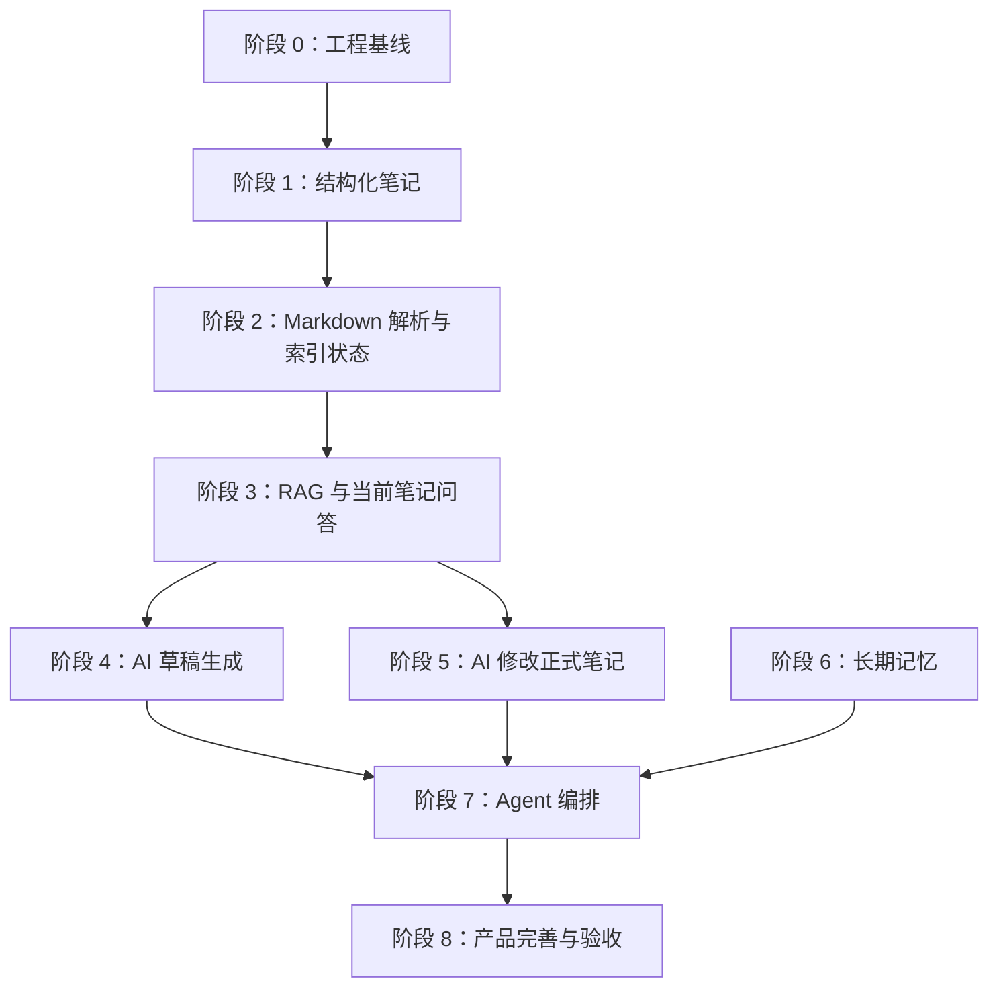

# NoteFlow 分阶段实施方案

版本：v1.0  
整理日期：2026-06-15  
依赖总设计书：`NoteFlow 统一完整设计书.md`

## 0. 文档目标

本文档用于把 `NoteFlow 统一完整设计书.md` 拆成可执行的工程阶段。

总设计书回答：

```text
NoteFlow 最终要做成什么？
```

本文档回答：

```text
从当前项目出发，先做什么，后做什么，每一阶段做到什么程度才算完成？
```

拆分原则：

```text
1. 先打基础，再做 AI。
2. 先有真实数据模型，再做 Agent 工具。
3. 先有结构化笔记，再做 RAG。
4. 先有预览和版本，再允许 AI 修改正式笔记。
5. 每个阶段都要能独立验收。
6. 不做只有页面、没有后端闭环的假功能。
```

## 1. 当前项目现状判断

当前 NoteFlow 已有：

```text
1. React + Vite + TypeScript 前端。
2. Python FastAPI 后端。
3. JWT 登录注册。
4. MySQL 和 Redis 基础连接。
5. 前端文件树式知识库。
6. Markdown 富文本编辑体验。
7. 整包 knowledge_bases JSON 同步。
8. 当前笔记 AI 问答雏形。
9. AI 生成笔记页面雏形，但最终不保留独立页面。
10. 设置页和健康检查雏形，但最终不保留独立设置页。
```

当前关键限制：

```text
1. 笔记不是结构化 notes 表，而是 tree_data + file_contents JSON 快照。
2. 没有 note_sections / note_chunks / note_embeddings。
3. 没有版本历史。
4. 没有回收站。
5. 没有真正 RAG 索引。
6. 当前笔记问答仍偏向直接传全文。
7. AI 生成页不是最终草稿生命周期，后续要并入工作台中间区域。
8. AI 修改正式笔记还没有 edit preview。
9. 没有 Chat History / Checkpoint / Tool Trace / Stream State。
10. 长期记忆还没有落地。
11. 当前仍有多页面导航心智，最终需要收敛为单工作台。
```

因此实施顺序不能从完整 Agent 开始，必须先把数据底座重构出来。

## 2. 总体阶段划分

建议拆成 9 个阶段：

```text
阶段 0：工程基线与迁移准备
阶段 1：结构化基础笔记系统
阶段 2：Markdown 解析与索引状态骨架
阶段 3：RAG 检索与当前笔记问答
阶段 4：AI 草稿生成工具 note_draft_tool
阶段 5：AI 正式笔记修改工具 note_edit_tool
阶段 6：长期记忆工具 memory_tool
阶段 7：Agent 编排器与运行状态
阶段 8：产品完善、测试闭环与工程兜底
```

整体依赖关系：



## 3. 阶段 0：工程基线与迁移准备

### 3.1 阶段目标

把当前项目整理成适合持续改造的状态，明确技术基线、迁移策略和验证方式。

这一阶段不追求新增大功能，重点是避免后续改造越改越乱。

### 3.2 必做范围

后端：

```text
1. 确认 FastAPI 启动方式和 README 一致。
2. 修正明显的后端导入、类型、依赖问题。
3. 明确数据库初始化策略：当前可继续用 SQLAlchemy create_all，后续再引入迁移工具。
4. 统一 user_id 类型，当前项目用户 ID 是 string，后续表先沿用 String(64)，不要混用 BIGINT。
5. 检查 Redis 限流依赖能否正常导入和启动。
```

前端：

```text
1. 保留当前 knowledge_bases JSON 同步作为兼容层。
2. 清理偏离最终方向的旧文案。
3. 标记即将被替换的数据层入口。
4. 保证 npm build 通过。
```

文档：

```text
1. 以 `NoteFlow 统一完整设计书.md` 为总蓝图。
2. 以本文档为开发路线。
3. 后续每阶段完成后更新实施记录。
```

### 3.3 交付物

```text
1. 项目能正常启动。
2. 前端 build 通过。
3. 后端基础导入检查通过。
4. README 与实际技术栈一致。
5. 明确旧 knowledge_bases JSON 后续只作为迁移和兼容来源。
```

### 3.4 验收标准

```text
[ ] npm run build 通过。
[ ] Python 后端模块能成功 import。
[ ] README 中不再出现 Go/Gin 旧描述。
[ ] 现有登录、知识库同步、主工作台不被破坏。
[ ] AI 生成页和设置页被明确标记为待并入工作台的原型。
```

### 3.5 本阶段不做

```text
不新增 Agent。
不接 embedding。
不一次性重构全部前端页面。
不删除旧 knowledge_bases 数据。
```

## 4. 阶段 1：结构化基础笔记系统

### 4.1 阶段目标

把当前 JSON 快照式知识库升级为结构化笔记系统。

这是整个项目最重要的基础阶段。没有结构化 notes，后续 RAG、版本、回收站、AI 修改都很难可靠实现。

### 4.2 核心目标

```text
1. 新增 notes 表。
2. 新增 note_categories 表。
3. 新增 note_versions 表的最小能力。
4. 新增软删除和恢复能力。
5. 前端能通过 notes API 读取和保存笔记。
6. 旧 knowledge_bases JSON 可以迁移为 notes / categories。
```

### 4.3 后端任务

新增模型：

```text
Note
NoteCategory
NoteVersion
```

建议字段：

```text
notes:
  id: String(64)
  user_id: String(64)
  title: String(255)
  category_id: String(64) nullable
  summary: Text nullable
  tags: JSON
  content: LongText
  is_pinned: Boolean
  is_favorite: Boolean
  index_status: String(50)
  created_at
  updated_at
  deleted_at

note_categories:
  id: String(64)
  user_id: String(64)
  name: String(100)
  parent_id: String(64) nullable
  sort_order: Int
  created_at
  updated_at
  deleted_at

note_versions:
  id: String(64)
  note_id: String(64)
  user_id: String(64)
  title: String(255)
  content: LongText
  change_summary: Text
  source: String(50)
  created_at
```

新增 API：

```http
POST   /api/notes
GET    /api/notes
GET    /api/notes/{noteId}
PUT    /api/notes/{noteId}
DELETE /api/notes/{noteId}
POST   /api/notes/{noteId}/restore

POST   /api/categories
GET    /api/categories
PUT    /api/categories/{categoryId}
DELETE /api/categories/{categoryId}

GET    /api/notes/{noteId}/versions
POST   /api/notes/{noteId}/versions/{versionId}/restore
```

权限要求：

```text
所有查询必须带 user_id 过滤。
模型不能从请求体传 user_id。
user_id 必须从 JWT 登录上下文获取。
```

版本要求：

```text
PUT /api/notes/{noteId} 修改 content 前，保存旧版本。
版本 source 可先支持 manual_edit、auto_save、restore。
```

迁移接口：

```http
POST /api/knowledge-base/migrate
```

迁移逻辑：

```text
1. 读取当前用户 knowledge_bases.tree_data 和 file_contents。
2. folder 转为 note_categories。
3. file 转为 notes。
4. file id 可临时保存在 notes.id，或建立 legacy_id 字段。
5. 已迁移过则不要重复创建。
6. 迁移完成后保留旧 knowledge_bases，不立即删除。
```

### 4.4 前端任务

数据层：

```text
1. 新增 notes service。
2. 新增 categories service。
3. 将 store 从 treeData/fileContents 逐步适配为 categories + notes。
4. 第一版可以在前端把 notes/categories 组装成原 DirectoryTree 需要的树结构，减少 UI 变动。
```

编辑器：

```text
1. 打开笔记时从 GET /api/notes/{noteId} 读取。
2. 编辑正文后走 PUT /api/notes/{noteId}。
3. 显示保存状态：未保存、保存中、已保存、保存失败。
4. 保存失败时保留本地草稿。
```

目录：

```text
1. 新建文件夹调用 /api/categories。
2. 新建笔记调用 /api/notes。
3. 删除笔记走软删除。
4. 置顶 / 收藏写入 notes 字段。
```

### 4.5 数据迁移策略

第一阶段允许双轨：

```text
旧数据：
  knowledge_bases 仍保留。

新数据：
  notes / note_categories 作为主数据源。

首次登录：
  如果 notes 为空且 knowledge_bases 有内容，提示或自动迁移。
```

迁移后：

```text
前端优先使用 notes API。
旧 knowledge_bases 只作为备份和回滚来源。
```

### 4.6 验收标准

```text
[ ] 能创建分类。
[ ] 能重命名分类。
[ ] 能创建笔记。
[ ] 能编辑笔记。
[ ] 刷新页面后笔记仍然存在。
[ ] 删除笔记后 notes.deleted_at 不为空。
[ ] 恢复笔记后 notes.deleted_at 为空。
[ ] 编辑笔记前能创建 note_versions。
[ ] 用户 A 看不到用户 B 的笔记。
[ ] 旧 knowledge_bases 能迁移到 notes/categories。
```

### 4.7 本阶段不做

```text
不做 embedding。
不做完整 RAG。
不做 AI 草稿工具。
不做 Agent 编排。
不做复杂标签推荐。
```

## 5. 阶段 2：Markdown 解析与索引状态骨架

### 5.1 阶段目标

让正式笔记保存后能被解析为小节和 chunk，并建立可见的索引状态。

这一阶段可以先不接真正向量模型，但必须把 RAG 的结构地基打出来。

### 5.2 核心目标

```text
1. 新增 note_sections。
2. 新增 note_chunks。
3. 新增 note_index_jobs。
4. 保存笔记后触发解析任务。
5. index_status 可见且真实更新。
6. 支持重新索引。
```

### 5.3 后端任务

新增模型：

```text
NoteSection
NoteChunk
NoteIndexJob
```

Markdown 解析：

```text
1. 按 H1-H4 标题解析小节层级。
2. 生成 section title、level、sort_order、content。
3. 无标题内容归入默认 section。
4. 保留 parent_id 关系。
```

Chunk 切分：

```text
1. 以 section 为单位切分。
2. 每个 chunk 控制在合理长度。
3. 保存 token_count 或近似字符计数。
4. 第一版可先不生成 embedding。
```

索引任务：

```text
保存笔记后：
  notes.index_status = outdated
  创建 note_index_jobs status = pending

执行解析时：
  notes.index_status = indexing
  note_index_jobs.status = running

成功：
  notes.index_status = indexed
  note_index_jobs.status = success

失败：
  notes.index_status = failed
  note_index_jobs.status = failed
  error_message 不为空
```

新增 API：

```http
POST /api/notes/{noteId}/reindex
GET  /api/notes/{noteId}/outline
GET  /api/index-jobs
```

### 5.4 前端任务

笔记详情页：

```text
1. 显示 AI 索引状态。
2. failed 状态显示重新索引按钮。
3. indexing 状态显示更新中。
4. indexed 状态显示已完成。
```

目录大纲：

```text
1. 可继续使用前端实时 headings。
2. 同时支持读取后端 /outline，用于 RAG 和 Agent。
```

### 5.5 验收标准

```text
[ ] 保存笔记后 note_sections 有记录。
[ ] 保存笔记后 note_chunks 有记录。
[ ] notes.index_status 从 outdated 到 indexing 到 indexed。
[ ] 解析失败时 index_status = failed。
[ ] note_index_jobs 记录错误信息。
[ ] 前端能展示索引状态。
[ ] 重新索引按钮可用。
```

### 5.6 本阶段不做

```text
不要求 embedding 一定完成。
不要求语义检索。
不做复杂 summary。
不做 Agent。
```

## 6. 阶段 3：RAG 检索与当前笔记问答

### 6.1 阶段目标

让 AI 能基于用户已有笔记和当前笔记回答问题，而不是简单把全文塞进 Prompt。

### 6.2 核心目标

```text
1. 实现 note_library_tool 的后端能力。
2. 实现全局搜索和上下文构建。
3. 实现 read_current_note_context。
4. 实现 Context Router 初版。
5. AI 回复展示来源。
6. 支持未保存内容参与当前笔记问答。
```

### 6.3 后端任务

note_library_tool action：

```text
hybrid_search_notes
read_note_outline
read_note_sections
read_note_context
read_current_note_context
list_related_notes
```

第一版检索策略：

```text
1. 标题匹配。
2. 标签匹配。
3. 分类匹配。
4. section 标题匹配。
5. chunk 正文关键词匹配。
6. 最近更新时间加权。
```

第二版再加入：

```text
embedding 相似度。
summary 相似度。
rerank。
```

Context Router 初版规则：

```text
有 selectedText 且问题包含“这段/这句”：
  selection

问题包含“这一节/这个小节”：
  section

问题是概念对比：
  retrieval

问题是总结：
  summary 或 full

问题是结构评价：
  structure

问题是认真看完整篇：
  progressive
```

当前笔记上下文优先级：

```text
selectedText
> unsavedContent 当前小节
> unsavedContent 全文
> 数据库 content
> RAG chunk
```

新增 API：

```http
POST /api/notes/search
POST /api/notes/context
POST /api/notes/{noteId}/context
POST /api/notes/{noteId}/sections/read
GET  /api/notes/{noteId}/related
```

AI chat 改造：

```text
旧 /api/ai/chat 可保留。
新增当前笔记问答逻辑时，不再默认直接传整篇全文。
先调用 context API，再把 context 放入模型 prompt。
```

### 6.4 前端任务

AI 面板：

```text
1. 发送问题时带 pageState。
2. pageState 包含 currentNoteId、selectedText、currentSectionId、dirty、unsavedContent。
3. AI 回复显示参考来源。
4. 快捷按钮改为最终推荐按钮。
```

快捷按钮：

```text
解释选中内容
总结当前笔记
补充项目例子
整理成面试表达
改得更通俗
优化当前小节
```

其中：

```text
解释选中内容、总结当前笔记：
  先走当前笔记问答。

补充项目例子、整理成面试表达、改得更通俗、优化当前小节：
  暂时可以提示“即将进入修改预览”，阶段 5 再接 edit preview。
```

### 6.5 验收标准

```text
[ ] 搜“回表”能找到正文包含回表的笔记。
[ ] 搜索结果包含命中小节和片段。
[ ] 当前笔记中问“缓存穿透和缓存击穿区别”，只在当前 noteId 内检索。
[ ] 选中文本问“这段是什么意思”，contextMode = selection。
[ ] 总结当前笔记时能使用 outline 和 summary/full。
[ ] AI 回复显示来源。
[ ] 未保存内容可以参与回答。
```

### 6.6 本阶段不做

```text
不做完整 Agent Orchestrator。
不做 AI 草稿生命周期。
不做正式笔记 edit preview。
不做长期记忆。
```

## 7. 阶段 4：AI 草稿生成工具 note_draft_tool

### 7.1 阶段目标

把现有 AI 生成页面中的生成配置、流式生成和保存逻辑，迁移为工作台中间区域的 AI 草稿模式。

AI 生成新笔记不能直接生成全文并保存，必须先大纲、再分节、再确认保存。

### 7.2 核心目标

```text
1. 新增 note_drafts。
2. 新增 note_draft_sections。
3. 新增 note_draft_section_versions。
4. 实现 create_outline。
5. 实现分节生成。
6. 支持小节修改、确认、删除、恢复。
7. 支持 assemble_draft。
8. 支持 save_to_notes。
9. 保存后触发索引任务。
```

### 7.3 后端任务

note_draft_tool action 初版：

```text
create_outline
revise_outline_node
delete_section
restore_section
generate_section
revise_section
regenerate_section
confirm_section
assemble_draft
save_to_notes
cancel_draft
```

第二版再做：

```text
plan_generation_batches
generate_batch_stream
lock_generation_style
restore_section_version
move_section
```

草稿保存逻辑：

```text
1. create_outline 只创建 draft 和 outline sections。
2. generate_section 只写 note_draft_sections.content。
3. save_to_notes 才写入 notes。
4. save_to_notes 前需要用户确认。
5. save_to_notes 后创建 note_versions source=draft_save。
6. save_to_notes 后创建 note_index_job。
```

SSE 事件：

```text
draft_batch_start
section_start
section_delta
section_done
batch_done
stream_error
```

### 7.4 前端任务

工作台 AI 草稿模式改造：

```text
1. 右侧 AI 助手负责接收“生成新笔记”的自然语言入口。
2. 中间区域切换为 AI 草稿大纲 / 草稿正文模式。
3. 大纲生成后展示“确认大纲”。
4. 小节可以单独生成。
5. 小节状态可见。
6. 保存按钮只有在草稿 assemble 后可用。
7. 保存前二次确认。
8. 不再保留独立 AI 生成页面。
```

草稿状态展示：

```text
未生成
生成中
已生成
需要修改
已确认
已删除
失败
```

### 7.5 验收标准

```text
[ ] 输入“生成 Redis 缓存三大问题笔记”后，只生成大纲，不直接生成全文。
[ ] note_drafts 有记录。
[ ] note_draft_sections 有 outline_only 记录。
[ ] 用户确认大纲后才能生成正文。
[ ] 能生成指定小节。
[ ] 小节生成后状态变为 generated。
[ ] 用户确认小节后状态变为 confirmed。
[ ] 保存草稿前有确认。
[ ] 保存后 notes 有新笔记。
[ ] 保存后创建索引任务。
```

### 7.6 本阶段不做

```text
不做完整 Agent Orchestrator。
不做长期记忆自动注入，最多预留 draft_config。
不做复杂批量暂停恢复，阶段 7 完善。
```

## 8. 阶段 5：AI 正式笔记修改工具 note_edit_tool

### 8.1 阶段目标

让 AI 能安全修改正式笔记，但不能直接写回。

必须先生成 edit preview，用户确认后才应用，并保存版本和更新索引。

### 8.2 核心目标

```text
1. 新增 note_edit_previews。
2. 实现 create_edit_preview。
3. 实现 revise_edit_preview。
4. 实现 apply_edit。
5. 实现 cancel_edit。
6. 支持 selection / section / note / insert / delete。
7. 应用前保存 note_versions。
8. 应用后更新索引状态。
```

### 8.3 后端任务

note_edit_tool action：

```text
create_edit_preview
revise_edit_preview
apply_edit
cancel_edit
restore_previous_version
insert_content_preview
delete_content_preview
```

范围定位：

```text
1. selectedText / selectionRange
2. currentSectionId
3. 用户话语中提到的小节标题
4. 当前 noteId
```

apply_edit：

```text
1. 读取 edit preview。
2. 校验状态 preview。
3. 保存旧版本。
4. 根据 target_type 更新 content。
5. 更新 notes。
6. 更新 sections/chunks 或标记 outdated。
7. 创建 index job。
8. edit preview 状态改为 applied。
```

### 8.4 前端任务

编辑器中间区新增 AI 修改预览模式：

```text
1. 展示原文。
2. 展示修改后内容。
3. 展示修改摘要。
4. 支持应用修改。
5. 支持继续调整。
6. 支持取消。
```

AI 面板：

```text
1. “补充项目例子”等快捷按钮接入 create_edit_preview。
2. 用户说“应用吧”时应用当前 edit preview。
3. 用户说“取消”时取消当前 edit preview。
```

### 8.5 验收标准

```text
[ ] 选中文本后说“改通俗一点”，生成 edit preview。
[ ] 创建 preview 后 notes.content 不变。
[ ] 预览能继续调整。
[ ] 点击应用后 notes.content 才更新。
[ ] 应用前 note_versions 新增旧版本。
[ ] 应用后 index_status 变为 outdated / indexing。
[ ] 取消 preview 后正式笔记不变。
[ ] 多个小节匹配时系统会追问，不乱改。
```

### 8.6 本阶段不做

```text
不做复杂整篇自动重构。
不做批量修改多个笔记。
不做完整 Agent 状态恢复。
```

## 9. 阶段 6：长期记忆工具 memory_tool

### 9.1 阶段目标

让 AI 能保存、查询、更新和删除用户长期偏好，并在生成和修改时参考。

### 9.2 核心目标

```text
1. 新增 user_memories。
2. 新增 user_memory_events。
3. 实现 memory_tool 基础 action。
4. 头像资料抽屉增加记忆管理。
5. 明确记忆保存规则。
6. 生成和修改流程可以查询 memory。
```

### 9.3 后端任务

memory_tool action：

```text
search_memory
save_memory
update_memory
delete_memory
list_memories
extract_memory
```

记忆类型：

```text
preference
goal
writing_style
project
skill
constraint
workflow
```

保存规则：

```text
明确“记住、以后、默认、从现在开始”：
  可以保存。

推断偏好：
  需要询问用户确认。

临时要求：
  不保存。
```

### 9.4 前端任务

头像资料抽屉：

```text
1. 记忆管理入口。
2. 按类型分组展示。
3. 支持编辑。
4. 支持删除。
5. 支持停用和启用。
6. 支持关闭记忆功能。
```

AI 面板：

```text
1. 用户问“你记住了什么”时展示记忆。
2. 用户明确说“记住”时保存。
3. 使用记忆时给轻提示，不要每次打扰。
```

### 9.5 验收标准

```text
[ ] 用户说“以后生成技术笔记都通俗一点”，user_memories 新增记录。
[ ] 用户说“你记住了什么”，能列出记忆。
[ ] 用户删除记忆后 status = deleted。
[ ] 删除后的记忆不再影响生成。
[ ] 当前输入和 memory 冲突时，当前输入优先。
[ ] 用户 A 看不到用户 B 的 memory。
```

### 9.6 本阶段不做

```text
不做复杂自动推断偏好。
不做敏感信息识别增强版。
不做记忆过期自动提醒。
```

## 10. 阶段 7：Agent 编排器与运行状态

### 10.1 阶段目标

把前面已经稳定的工具整合为真正的 Agent 系统。

此时再做 Orchestrator，避免工具还没成型就陷入复杂调度。

### 10.2 核心目标

```text
1. 实现 /api/agent/chat。
2. 实现意图识别。
3. 实现 Workflow 路由。
4. 接入 memory_tool / note_library_tool / note_draft_tool / note_edit_tool。
5. 新增 Chat History。
6. 新增 Checkpoint。
7. 新增 Tool Trace。
8. 新增 Stream State。
9. 支持等待确认和恢复任务。
```

### 10.3 后端任务

新增模型：

```text
ChatSession
ChatMessage
AgentCheckpoint
AgentToolTrace
AgentRun
AgentStep
```

Stream State：

```text
优先用 Redis 保存运行中流式状态。
完成后的业务内容写入业务表。
```

意图类型：

```text
note_draft_create
note_draft_continue
note_draft_modify
note_draft_save
note_search
note_read
note_context_qa
note_edit_create
note_edit_revise
note_edit_apply
note_edit_cancel
memory_manage
confirm_action
cancel_action
general_chat
```

确认优先：

```text
如果当前 checkpoint.status = waiting_user_confirm，
用户说“可以、确认、应用吧、保存吧、取消”，
必须优先解释为对当前任务的确认或取消。
```

### 10.4 前端任务

AI 面板：

```text
1. 改为调用 /api/agent/chat。
2. 展示 Chat History。
3. 展示工具执行轨迹摘要。
4. 展示等待确认卡片。
5. 展示未完成任务恢复提示。
```

任务状态条：

```text
当前任务：生成《Redis 缓存三大问题》
状态：正在生成第 3/8 个小节
[暂停] [继续] [取消]
```

### 10.5 验收标准

```text
[ ] 用户基于已有笔记生成新笔记时，Tool Trace 顺序包含 memory、library、draft。
[ ] 生成大纲后 Checkpoint = waiting_user_confirm。
[ ] 用户说“继续”后能从 Checkpoint 继续。
[ ] 创建 edit preview 后用户说“应用吧”，系统调用 apply_edit，而不是重新生成。
[ ] 刷新页面后 Chat History 能恢复。
[ ] 未完成任务能提示恢复。
[ ] Tool Trace 记录 tool_name、action、status、duration。
```

### 10.6 本阶段不做

```text
不做过度复杂的自主规划。
不展示完整内部思考链。
不允许 Agent 绕过工具直接写库。
```

## 11. 阶段 8：产品完善、测试闭环与工程兜底

### 11.1 阶段目标

把项目从“核心功能能跑”提升到“完整产品可信可展示”。

### 11.2 核心目标

```text
1. 工作台空状态总览。
2. 任务状态条 / 任务面板。
3. 头像资料抽屉完善。
4. 成本统计。
5. 限流完善。
6. 错误重试。
7. 数据导出和备份。
8. 完整测试用例。
9. 面试展示路径。
```

### 11.3 后端任务

统计接口：

```text
1. 笔记数量。
2. 已索引数量。
3. 索引失败数量。
4. 未完成任务数量。
5. AI 调用次数。
6. token 和成本估算。
```

ai_usage_logs：

```text
记录 tool_name、action、model、prompt_tokens、completion_tokens、total_tokens、estimated_cost。
```

限流：

```text
每分钟 AI 请求次数。
每日 token 数。
每日 embedding 次数。
同时运行任务数。
```

### 11.4 前端任务

工作台空状态总览：

```text
最近编辑笔记
最近 AI 草稿
未完成任务
知识库索引状态
快捷入口
```

任务状态条 / 任务面板：

```text
任务类型
当前状态
当前进度
创建时间
继续 / 暂停 / 取消 / 重试 / 查看详情
```

头像资料抽屉：

```text
AI 模型设置
默认生成风格
RAG 设置
记忆管理
索引管理
成本统计
数据导出
安全设置
```

### 11.5 验收标准

```text
[ ] 工作台空状态统计真实来自后端。
[ ] 任务状态条 / 任务面板能看到未完成任务。
[ ] 成本统计有真实记录。
[ ] 限流触发时返回 429 并友好提示。
[ ] 模型失败可重试。
[ ] SSE 中断能恢复或拉取最终状态。
[ ] 数据导出可用。
[ ] 功能测试说明书中的核心用例通过。
```

## 12. 每阶段通用完成定义

每个阶段完成时必须满足：

```text
1. 前端页面可操作。
2. 后端接口真实写入数据库。
3. 刷新页面后数据不丢失。
4. 用户隔离正确。
5. 失败状态可见。
6. 关键操作有测试步骤。
7. npm run build 通过。
8. Python 代码基础检查通过。
```

如果一个功能只有 UI，没有后端和数据库闭环，不算完成。

## 13. 推荐实际开工顺序

最实际的开工顺序：

```text
1. 阶段 0：确认基线。
2. 阶段 1：实现 notes/categories/versions。
3. 把前端从 JSON 快照切到 notes API。
4. 阶段 2：实现 Markdown 解析和 index_status。
5. 阶段 3：实现当前笔记上下文读取。
6. 阶段 3 完成后，再决定是否先做草稿还是先做修改预览。
```

建议不要先做：

```text
完整 Agent Orchestrator
复杂向量库
高级记忆推断
复杂知识图谱
课程/题库系统
团队协作
```

## 14. 第一阶段详细拆分建议

如果马上开始编码，第一阶段可以拆成 5 个小 PR 或小任务：

### 14.1 任务 1：新增后端模型和 CRUD

```text
新增 Note、NoteCategory、NoteVersion。
新增 /api/notes 和 /api/categories。
完成 user_id 隔离。
```

验收：

```text
用接口能创建、读取、修改、删除、恢复笔记。
```

### 14.2 任务 2：前端 notes service

```text
新增 notes.ts。
新增 categories.ts。
保留旧 knowledgeBase.ts。
```

验收：

```text
前端能读取后端 notes 列表。
```

### 14.3 任务 3：DirectoryTree 接结构化数据

```text
把 categories + notes 组装成当前树组件可用的数据。
新建、重命名、删除走新 API。
```

验收：

```text
新建笔记刷新后仍在。
删除后进入软删除状态。
```

### 14.4 任务 4：NoteEditor 自动保存改造

```text
编辑正文走 PUT /api/notes/{noteId}。
增加保存状态。
保存失败保留本地草稿。
```

验收：

```text
编辑后等待自动保存，刷新内容不丢。
```

### 14.5 任务 5：旧 knowledge_bases 迁移

```text
首次进入时，如果 notes 为空但旧 knowledge_bases 有内容，则迁移。
```

验收：

```text
旧文件树和内容变成 notes/categories。
```

## 15. 风险与控制

### 15.1 最大风险：范围过大

控制方式：

```text
每阶段只做当前阶段需要的最小闭环。
不提前做完整 Agent。
不提前做复杂 RAG。
```

### 15.2 数据迁移风险

控制方式：

```text
保留旧 knowledge_bases。
迁移幂等。
迁移前后都能导出备份。
```

### 15.3 AI 功能假闭环风险

控制方式：

```text
每个 AI 动作必须有业务表记录。
每个工具调用必须能查 Tool Trace。
每个危险动作必须有确认节点。
```

### 15.4 RAG 假实现风险

控制方式：

```text
先做 sections/chunks。
搜索结果必须有命中片段和来源。
不能只按标题 like。
```

### 15.5 正式笔记被 AI 改坏风险

控制方式：

```text
edit preview 强制预览。
apply_edit 前保存版本。
恢复版本可用。
```

## 16. 阶段完成后的项目表达

阶段 1 完成后：

```text
NoteFlow 已经从本地 JSON 快照知识库升级为结构化笔记系统，支持用户隔离、分类、笔记 CRUD、自动保存和版本记录。
```

阶段 2 完成后：

```text
NoteFlow 能将 Markdown 笔记解析为 section 和 chunk，并维护 AI 索引状态，为 RAG 检索打下基础。
```

阶段 3 完成后：

```text
NoteFlow 支持当前笔记范围内的上下文问答，不再简单全文塞 Prompt，而是根据问题选择 selection、section、retrieval、summary 等上下文。
```

阶段 4 完成后：

```text
NoteFlow 的 AI 新建笔记不再是一键生成全文，而是大纲确认、分节生成、草稿预览、用户确认保存。
```

阶段 5 完成后：

```text
NoteFlow 支持 AI 安全修改正式笔记，修改先进入 edit preview，用户确认后才写回，并保存版本和更新索引。
```

阶段 7 完成后：

```text
NoteFlow 具备 Agent 编排能力，可以根据用户意图调度 memory、library、draft、edit 工具，并通过 Checkpoint、Tool Trace、Stream State 支持恢复和追踪。
```

## 17. 阶段实施记录

### 17.1 阶段 0 实施记录

实施日期：2026-06-15

已完成：

```text
1. 确认后端启动方式为 `cd server && python3 -m app.main`，README 与实际 FastAPI 技术栈一致。
2. README 补充单工作台产品方向、数据库初始化策略、user_id 类型约束、knowledge_bases 兼容层定位。
3. server/README 补充 create_all、String(64) user_id、Redis 可选降级和 knowledge_bases 兼容说明。
4. 前端入口从多页面导航收敛为登录后的单工作台：左侧目录、中间笔记、右侧 AI 助手常驻。
5. 移除正式导航中的独立 AI 生成页和独立设置页入口。
6. 头像菜单承接基础资料与偏好：账号信息、知识库统计、显示模式、导出知识库、退出登录。
7. `AIGeneratePage` 和 `SettingsPage` 已标记为迁移原型，不再作为正式页面方向。
8. `defaultViewOptions` 收敛为“笔记工作台”，历史 `ai-generate` 默认入口会被 normalize 回工作台。
```

自查：

```text
[x] npm run build 通过。
[x] Python 后端模块能成功 import。
[x] README 中不再出现 Go/Gin 旧描述。
[x] 现有登录、知识库同步、主工作台不被破坏。
[x] AI 生成页和设置页被明确标记为待并入工作台的原型。
```

留到后续阶段：

```text
1. 旧 knowledge_bases JSON 暂不删除，阶段 1 迁移到结构化 notes/categories/versions。
2. AI 生成原型暂不拆分，阶段 4 迁移为工作台中间区域的 AI 草稿模式。
3. 设置原型暂不完整迁移，阶段 6/8 扩展头像资料抽屉里的记忆、模型、导出与安全设置。
```

### 17.2 阶段 1 实施记录

实施日期：2026-06-15

已完成：

```text
1. 新增后端结构化模型：note_categories、notes、note_versions。
2. 新增分类 API：创建、列表、重命名/移动、软删除分类。
3. 新增笔记 API：创建、列表、读取、更新、软删除、恢复。
4. 新增版本 API：读取版本列表、从指定版本恢复。
5. PUT /api/notes/{noteId} 在正文变更前写入 note_versions，source 支持 manual_edit、auto_save、restore。
6. 所有 notes/categories/versions 查询与写入均从 JWT CurrentUser 获取 user_id，不从请求体读取 user_id。
7. 新增 POST /api/knowledge-base/migrate，把旧 knowledge_bases.tree_data/file_contents 迁移为 categories/notes。
8. 前端新增 notes service 和 categories service。
9. 前端 store 改为优先加载结构化 notes/categories，并组装回现有 DirectoryTree 需要的 FileNode 树。
10. 首次进入如果结构化数据为空，会先确保旧 knowledge_bases 快照存在，再调用迁移接口。
11. 编辑器正文变更后通过 debounced PUT /api/notes/{noteId} 自动保存，并显示未保存、保存中、已保存、保存失败。
12. 目录中新建文件夹、新建笔记、重命名、移动、删除、置顶笔记均接入结构化 API。
13. 左侧工作台新增轻量回收站，支持恢复被软删除的笔记。
14. 旧 knowledge_bases 仍保留，并继续作为兼容备份写入。
```

自查：

```text
[x] 能创建分类：DirectoryTree -> createCategory -> POST /api/categories。
[x] 能重命名分类：DirectoryTree -> updateCategory -> PUT /api/categories/{categoryId}。
[x] 能创建笔记：DirectoryTree -> createNote -> POST /api/notes。
[x] 能编辑笔记：NoteEditor -> updateFileContent -> PUT /api/notes/{noteId}。
[x] 删除笔记后 notes.deleted_at 不为空：DELETE /api/notes/{noteId} 软删除实现。
[x] 恢复笔记后 notes.deleted_at 为空：POST /api/notes/{noteId}/restore 实现，并有回收站入口。
[x] 编辑笔记前能创建 note_versions：正文变更时先保存旧版本。
[x] 用户 A 看不到用户 B 的笔记：所有查询和写入都有 user_id 条件。
[x] 旧 knowledge_bases 能迁移到 notes/categories：POST /api/knowledge-base/migrate 实现。
[x] npm run build 通过。
[x] Python 后端模块能成功 import。
[x] Python compileall 通过。
[x] 刷新页面后笔记仍然存在：真实 MySQL/Docker 环境下通过 GET /api/notes 读取已创建和已迁移笔记。
```

运行检查：

```text
1. npm run build：通过。
2. PYTHONPYCACHEPREFIX=/private/tmp/noteflow-pycache python3 -m compileall -q server/app：通过。
3. cd server && python3 -c 'import app.main; print("backend import ok")'：通过。
4. Vite 本地页面加载：通过，登录页渲染正常，浏览器控制台无 error。
5. Docker 临时后端容器 + 真实 MySQL/Redis 接口验收：通过。
   覆盖注册、用户隔离、创建分类、重命名分类、创建笔记、读取笔记、编辑笔记、版本创建、软删除、恢复、旧 knowledge_bases 迁移。
```

留到后续阶段：

```text
1. 分类恢复暂未做 UI，当前回收站先支持恢复笔记；完整回收站放到阶段 8 产品完善。
2. note_versions 目前有 API，没有版本列表 UI；阶段 5 做 AI 修改和版本恢复体验时完善。
3. 结构化数据已具备 index_status 字段，Markdown 解析和索引状态维护进入阶段 2。
```

### 17.3 阶段 2 实施记录

实施日期：2026-06-15

已完成：

```text
1. 新增后端索引模型：note_sections、note_chunks、note_index_jobs。
2. 新增 Markdown 解析服务，按 H1-H4 解析小节层级，保留 parent_id、level、sort_order、content。
3. 无标题正文会归入默认“正文”小节。
4. 新增 chunk 切分逻辑，以 section 为单位按段落切分，记录近似 token_count。
5. 创建笔记后自动创建索引任务并解析 sections/chunks。
6. 更新笔记正文后先保存 note_versions，再重新解析 sections/chunks。
7. 索引任务真实记录 pending/running/success/failed 状态，笔记 index_status 真实更新为 outdated/indexing/indexed/failed。
8. 新增 POST /api/notes/{noteId}/reindex。
9. 新增 GET /api/notes/{noteId}/outline。
10. 新增 GET /api/index-jobs。
11. 前端 notes service 接入 outline、reindex、index-jobs。
12. FileNode 兼容层新增 indexStatus。
13. 编辑器标题区显示 AI 索引状态和后端解析小节数。
14. 编辑器标题区提供“重新索引”按钮。
```

自查：

```text
[x] 保存笔记后 note_sections 有记录。
[x] 保存笔记后 note_chunks 有记录。
[x] notes.index_status 从 outdated/indexing 任务流程进入 indexed。
[x] note_index_jobs 记录任务状态。
[x] 前端能展示索引状态。
[x] 重新索引按钮可用。
[x] npm run build 通过。
[x] Python 后端模块能成功 import。
[x] Python compileall 通过。
```

运行检查：

```text
1. npm run build：通过。
2. PYTHONPYCACHEPREFIX=/private/tmp/noteflow-pycache python3 -m compileall -q server/app：通过。
3. cd server && python3 -c 'import app.main; print("backend import ok")'：通过。
4. Stage 2 API 验收脚本：通过。
   覆盖注册、创建带 H1-H4 的笔记、读取 outline、更新正文后重建 outline、手动 reindex、index-jobs success。
5. MySQL 真实落库检查：通过。
   测试笔记 note_sections = 5，note_chunks = 5，note_index_jobs = 3。
6. Vite 页面加载：通过，浏览器控制台无 error。
```

留到后续阶段：

```text
1. 本阶段不生成 embedding，阶段 3 接 RAG 检索时再接真正向量或检索策略。
2. 索引任务目前同步执行，阶段 7 Agent/Workflow 时可升级为后台任务和可恢复任务。
3. 前端目前显示当前笔记索引状态，完整任务状态面板留到阶段 8。
```

### 17.4 阶段 3 实施记录

实施日期：2026-06-16

已完成：

```text
1. 新增 note_library_tool 后端检索服务。
2. 实现 hybrid_search_notes：标题、标签、分类、小节标题、chunk 正文、笔记正文 fallback、最近更新时间加权。
3. 实现 read_note_outline、read_note_sections、read_note_context/read_current_note_context、list_related_notes 的后端能力。
4. 新增 Context Router 初版，支持 selection、section、retrieval、summary、structure、full 等上下文模式。
5. 当前笔记上下文优先级支持 selectedText、unsavedContent、数据库 content、RAG chunk。
6. 新增 POST /api/notes/search。
7. 新增 POST /api/notes/context。
8. 新增 POST /api/notes/{noteId}/context。
9. 新增 POST /api/notes/{noteId}/sections/read。
10. 新增 GET /api/notes/{noteId}/related。
11. /api/ai/chat 支持 pageState，发送前先构建当前笔记上下文。
12. /api/ai/chat SSE 会先返回 context 事件，包含 contextMode 和 sources。
13. 修复 Redis 限流依赖缺少 FastAPI Request 导入导致 /api/ai/chat 422 的旧问题。
14. 前端 AI 面板发送问题时携带 currentNoteId、selectedText、dirty、unsavedContent。
15. 前端 AI 回复卡片展示参考来源和上下文模式。
16. 快捷按钮更新为阶段 3 推荐动作：解释选中内容、总结当前笔记、补充项目例子、整理成面试表达、改得更通俗、优化当前小节。
```

自查：

```text
[x] 搜“回表”能找到正文包含回表的笔记。
[x] 搜索结果包含命中小节和片段。
[x] 当前笔记中问“缓存穿透和缓存击穿区别”，只在当前 noteId 内检索。
[x] 选中文本问“这段是什么意思”，contextMode = selection。
[x] 总结当前笔记时能使用 outline 和 summary/full。
[x] AI 回复能收到并展示来源。
[x] 未保存内容可以参与回答。
[x] npm run build 通过。
[x] Python 后端模块能成功 import。
[x] Python compileall 通过。
```

运行检查：

```text
1. npm run build：通过。
2. PYTHONPYCACHEPREFIX=/private/tmp/noteflow-pycache python3 -m compileall -q server/app：通过。
3. cd server && python3 -c 'import app.main; print("backend import ok")'：通过。
4. Stage 3 API 验收脚本：通过。
   覆盖注册、创建检索测试笔记、搜索“回表”、当前笔记检索、selection context、summary context、unsavedContent context、/api/ai/chat context SSE 事件。
5. Vite 页面加载：通过，浏览器控制台无 error。
```

留到后续阶段：

```text
1. 本阶段仍是关键词/结构检索，未接 embedding、rerank 和 summary 相似度。
2. 修改类快捷按钮暂未进入 edit preview，阶段 5 接正式笔记修改工具。
3. 来源展示已在 AI 回复卡片中完成，完整引用跳转和来源定位留到阶段 8 打磨。
```

### 17.5 阶段 4 实施记录

实施日期：2026-06-16

已完成：

```text
1. 新增 note_drafts 模型，记录 AI 草稿主题、配置、大纲、组装正文、保存状态和正式笔记关联。
2. 新增 note_draft_sections 模型，记录草稿小节标题、层级、排序、outline_text、content、状态、删除和确认时间。
3. 新增 note_draft_section_versions 模型，为小节生成、修改、确认、删除、恢复保留版本快照。
4. 新增 drafts 后端路由并接入 main.py。
5. 新增 POST /api/note-drafts，作为 create_outline 的落库入口。
6. 新增 PUT /api/note-drafts/{draftId}，支持更新大纲、组装正文和重建小节。
7. 新增 PUT /api/note-drafts/{draftId}/sections/{sectionId}，支持 revise_outline_node / revise_section。
8. 新增 POST /api/note-drafts/{draftId}/sections/{sectionId}/generate，支持 generate_section 写入小节正文。
9. 新增 confirm/delete/restore 小节接口，支持 confirm_section、delete_section、restore_section。
10. 新增 POST /api/note-drafts/{draftId}/assemble，支持 assemble_draft。
11. 新增 POST /api/note-drafts/{draftId}/save-to-notes，支持 save_to_notes。
12. 保存正式笔记前要求 confirm=true。
13. save_to_notes 后写入 notes。
14. save_to_notes 后创建 note_versions，source=draft_save。
15. save_to_notes 后同步触发 Markdown 索引，创建 note_index_jobs，并更新 notes.index_status。
16. 新增前端草稿服务 src/services/drafts.ts。
17. 新增工作台中间区域 AIDraftWorkspace，承载生成配置、大纲、小节状态、正文预览、小节修改、保存正式笔记。
18. App 中间区支持 note / draft 两种模式，不新增独立页面。
19. 右侧 AI 助手识别“生成/创建/新建/写/整理 ... 笔记/文档/教程”等自然语言入口，切换到中间草稿模式。
20. 草稿模式从右侧用户输入自动提取主题。
21. 大纲生成后才创建草稿小节，正文生成按钮在有大纲小节后才可用。
22. 小节支持单独生成、确认、删除、恢复和手动保存修改。
23. 草稿保存按钮只有 assemble 后可用。
24. 保存前有浏览器二次确认。
25. 删除旧的独立 AI 创建笔记页面文件，生成新笔记不再进入普通问答链路。
26. 删除旧的独立设置页面文件，设置入口保留在左侧头像账号菜单。
27. 废弃旧固定模板配置：不再展示学习笔记/面试笔记/考试复习/项目笔记、写作口吻、笔记形态、标题层级、代码示例、练习题等固定选项。
28. 草稿配置改为自然语言“生成需求”输入，由 AI 自动推断笔记类型、写作口吻、结构层级、深度和是否需要示例。
```

自查：

```text
[x] 输入“生成 Redis 缓存三大问题笔记”后，中间区域切换为 AI 草稿模式。
[x] 草稿模式只先展示大纲生成入口，不直接生成全文和保存。
[x] note_drafts 有记录。
[x] note_draft_sections 有 outline_only 记录。
[x] 用户确认大纲后才能生成正文。
[x] 能生成指定小节。
[x] 小节生成后状态变为 generated。
[x] 用户确认小节后状态变为 confirmed。
[x] 小节可删除和恢复。
[x] 保存草稿前有确认。
[x] 保存后 notes 有新笔记。
[x] 保存后创建 note_versions source=draft_save。
[x] 保存后创建索引任务并进入 indexed。
[x] npm run build 通过。
[x] Python compileall 通过。
```

运行检查：

```text
1. npm run build：通过。
2. PYTHONPYCACHEPREFIX=/private/tmp/noteflow_pycache python3 -m compileall server/app：通过。
3. Stage 4 API 验收脚本：通过。
   覆盖注册、创建草稿、outline 解析为小节、生成小节、确认小节、删除恢复小节、组装草稿、保存正式笔记、draft_save 版本、索引任务 success。
4. Vite 页面加载：通过。
5. 浏览器工作台验证：通过。
   右侧输入“生成 Redis 缓存三大问题笔记”后，中间区域显示“工作台 / AI 草稿”，主题自动填入“Redis 缓存三大问题”。
```

留到后续阶段：

```text
1. 本阶段 AI 正文流仍复用现有 /api/ai/notes/generate；后续阶段 7 再把草稿生成升级为完整 Workflow/ReAct 可恢复任务。
2. SSE 事件 draft_batch_start、section_start、section_delta、section_done、batch_done 暂未拆成独立后端流，当前由前端逐节调用流式生成并落库。
3. 小节版本已落库，版本列表和恢复指定版本的 UI 留到阶段 8 打磨。
4. 当前草稿保存后的自动选中新笔记依赖工作台 reload；阶段 8 可继续增加保存完成 toast 和来源定位。
```

### 17.6 阶段 5 实施记录

实施日期：2026-06-16

已完成：

```text
1. 新增 note_edit_previews 模型，记录正式笔记 AI 修改预览、目标范围、原文、修改后内容、摘要和状态。
2. 新增 edits 后端路由并接入 main.py。
3. 新增 POST /api/note-edit-previews，支持 create_edit_preview。
4. 新增 GET /api/note-edit-previews/{editId}，支持读取预览。
5. 新增 POST /api/note-edit-previews/{editId}/revise，支持 revise_edit_preview。
6. 新增 POST /api/note-edit-previews/{editId}/apply，支持 apply_edit。
7. 新增 POST /api/note-edit-previews/{editId}/cancel，支持 cancel_edit。
8. apply_edit 前创建 note_versions，source=ai_edit。
9. apply_edit 后写回 notes.content，并同步更新 sections/chunks/index_jobs。
10. 支持 selection / section / note / insert / delete 的范围解析。
11. 修复安全边界：选区删除/插入以 selectedText 为准。
12. 修复安全边界：小节定位不到时返回错误，不退回整篇笔记。
13. 多个同名小节匹配时返回 409 和候选小节，不随机修改。
14. 新增前端 edit preview 服务 src/services/edits.ts。
15. 全局工作台状态新增 note / draft / edit 三种 centerMode。
16. 新增 EditPreviewWorkspace，中间区展示原文、修改后内容、修改摘要、应用、继续调整、取消。
17. 右侧 AI 助手接入修改类意图，明确区分普通问答、草稿生成和正式笔记修改。
18. 快捷按钮“补充项目例子 / 整理成面试表达 / 优化当前小节”等进入 edit preview 流程。
19. 已有预览时，用户继续输入会 revise preview；输入“应用吧”应用；输入“取消”取消。
20. 取消预览后正式笔记不变，并回到普通笔记编辑器。
```

自查：

```text
[x] 选中文本后说“改通俗一点”，会按 selection 创建 edit preview。
[x] 创建 preview 后 notes.content 不变。
[x] 预览支持继续调整入口。
[x] 点击应用后 notes.content 才更新。
[x] 应用前 note_versions 新增旧版本。
[x] 应用后 index_status 更新到 indexed，并创建 index job。
[x] 取消 preview 后正式笔记不变。
[x] 多个小节匹配时系统返回 409，不乱改。
[x] 小节定位不到时返回错误，不退回整篇。
[x] npm run build 通过。
[x] Python compileall 通过。
```

运行检查：

```text
1. npm run build：通过。
2. PYTHONPYCACHEPREFIX=/private/tmp/noteflow_pycache python3 -m compileall server/app：通过。
3. Stage 5 API 验收脚本：通过。
   覆盖注册、创建正式笔记、创建删除预览、预览前正文不变、应用预览、ai_edit 版本、索引任务 success、取消预览、多小节匹配 409、小节定位不到 400。
4. 浏览器工作台验证：通过。
   右侧快捷按钮“补充项目例子”生成 AI 修改预览，中间区显示原文/修改后/摘要，取消后回到正式笔记编辑器且内容未应用。
```

留到后续阶段：

```text
1. restore_previous_version 的完整 UI 和版本列表留到阶段 8 打磨。
2. 当前小节自动识别暂未接编辑器滚动 active heading；阶段 8 可把 active sectionId 纳入 pageState。
3. edit preview 暂未做跨刷新恢复，阶段 7/8 可接 Agent 通用运行状态。
```

### 17.7 阶段 6 实施记录

实施日期：2026-06-16

已完成：

```text
1. 新增 user_memories 模型，记录 memory_type、content、importance、confidence、source、scope、tags、status、last_used_at、access_count、deleted_at。
2. 新增 user_memory_events 模型，记录 created / updated / deleted / archived / used 等记忆事件。
3. 新增 memory service，支持类型归一、明确记忆提取、记忆搜索、记忆上下文构建。
4. 新增 memories 后端路由并接入 main.py。
5. 新增 GET /api/memories，支持列出当前用户记忆。
6. 新增 POST /api/memories/search，支持 search_memory，并记录 used 事件和 access_count。
7. 新增 POST /api/memories/extract，支持 extract_memory 的规则版。
8. 新增 POST /api/memories，支持 save_memory。
9. 新增 PUT /api/memories/{memoryId}，支持 update_memory、停用和启用。
10. 新增 DELETE /api/memories/{memoryId}，支持软删除，status=deleted。
11. /api/ai/chat 接入长期记忆上下文。
12. /api/ai/notes/generate 接入长期记忆上下文。
13. note_edit_preview / revise_edit_preview 接入长期记忆上下文。
14. 提示词明确“用户当前明确要求优先于长期记忆”。
15. 新增前端 memory 服务 src/services/memories.ts。
16. 右侧 AI 助手识别“记住、以后、默认、从现在开始”等明确记忆指令，并保存长期记忆。
17. 右侧 AI 助手识别“你记住了什么 / 长期记忆 / 我的偏好”等查询指令，并直接列出本地记忆。
18. 头像资料抽屉新增长期记忆开关。
19. 头像资料抽屉新增记忆管理，支持按类型展示、编辑、停用/启用、删除。
20. 记忆开关会影响聊天、草稿生成和正式修改预览是否使用长期记忆。
```

自查：

```text
[x] 用户说“以后生成技术笔记都通俗一点”，extract_memory 能提取候选记忆。
[x] save_memory 后 user_memories 新增记录。
[x] 用户说“你记住了什么”，前端会走 listMemoryRequest，不进入普通问答检索。
[x] 用户删除记忆后 status=deleted，deleted_at 有值。
[x] 删除后的记忆不会出现在 search_memory 结果中。
[x] 停用 archived 的记忆不会影响生成和修改。
[x] 当前输入和 memory 冲突时，提示词要求当前输入优先。
[x] 用户 A 看不到用户 B 的 memory。
[x] 头像资料抽屉可打开记忆管理。
[x] npm run build 通过。
[x] Python compileall 通过。
```

运行检查：

```text
1. npm run build：通过。
2. PYTHONPYCACHEPREFIX=/private/tmp/noteflow_pycache python3 -m compileall server/app：通过。
3. Stage 6 API 验收脚本：通过。
   覆盖注册、明确记忆提取、保存、列表、搜索、access_count、更新、停用、启用、软删除、删除后不检索、用户隔离、临时要求不保存。
4. 浏览器工作台验证：通过。
   头像资料抽屉显示“长期记忆”和“记忆管理”，展开后能看到记忆状态和列表区域。
```

留到后续阶段：

```text
1. extract_memory 当前为规则版，阶段 7 Agent 编排后再升级为模型辅助提取和确认流。
2. 记忆冲突处理当前以用户手动编辑/停用为主，阶段 7/8 可增加同类型目标自动归档。
3. 记忆使用轻提示目前只在保存/列表场景明显展示，阶段 8 可增加更细的“本次已参考记忆”弱提示。
4. 记忆开关目前保存在浏览器本地，后续可升级为服务端用户偏好。
```
