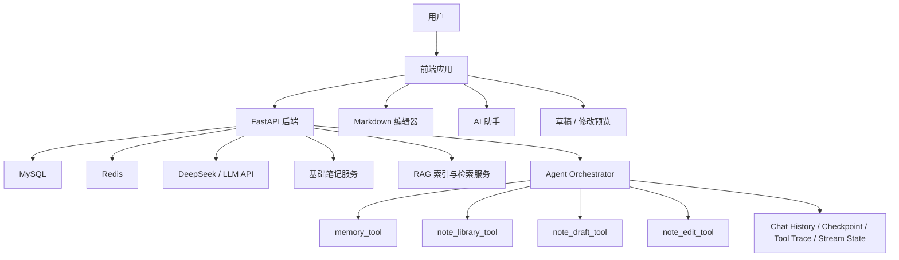

# NoteFlow 统一完整设计书

版本：v1.0  
整理日期：2026-06-15  
适用项目：NoteFlow 智能笔记知识库系统

## 0. 文档说明

本文档用于合并、去重并统一以下设计资料，形成一份可以直接指导产品、前端、后端、Agent 和测试开发的总设计书。

参考资料：

- `NoteFlow 智能笔记项目完整功能设计书.md`
- `NoteFlow 笔记草稿生成工具最终版说明书.md`
- `NoteFlow 笔记查询与读取工具最终版说明书.md`
- `NoteFlow 当前笔记问答与上下文路由机制说明书.md`
- `NoteFlow 正式笔记修改工具需求说明书.md`
- `NoteFlow 长期记忆工具需求说明书.md`
- `NoteFlow Agent 编排器与 Workflow + ReAct 执行流程说明书.md`
- `NoteFlow Agent 通用运行状态说明书.md`
- `NoteFlow 功能测试说明书.md`

本文档不是简单拼接原文，而是将所有资料整理为统一架构：

```text
产品定位
→ 核心原则
→ 页面与用户流程
→ 数据模型
→ 工具边界
→ Agent 编排
→ API 设计
→ 运行状态
→ 错误处理
→ 开发阶段
→ 测试验收
```

## 1. 项目定位

### 1.1 项目名称

```text
NoteFlow
```

### 1.2 产品定位

NoteFlow 是一个面向学习者、求职者、自学者和开发者的 AI 智能笔记知识库系统。

它不是普通 AI 聊天框，也不是单纯 Markdown 编辑器，而是一个围绕个人知识库展开的智能笔记产品。

核心目标：

```text
用户可以写笔记、管理笔记、搜索笔记。
AI 可以理解笔记、查询笔记、回答当前笔记问题。
AI 可以基于已有笔记生成新笔记草稿。
AI 可以安全地辅助修改正式笔记。
系统通过长期记忆逐渐适配用户的学习目标和写作偏好。
所有重要 AI 操作都可控、可恢复、可追踪。
```

一句话描述：

```text
NoteFlow 是一个带 RAG、Agent 工具调用、长期记忆、AI 草稿生成、当前笔记问答和安全修改机制的智能笔记系统。
```

### 1.3 目标用户

- 正在准备面试的学习者
- 需要整理技术知识的开发者
- 习惯用 Markdown 记录知识的自学者
- 希望把碎片知识沉淀成长期知识库的用户
- 希望 AI 按自己的风格生成、查询和修改笔记的用户

## 2. 总体设计原则

### 2.1 笔记是核心，不是 AI 聊天套壳

所有 AI 能力都必须服务于笔记：

```text
写笔记
查笔记
问笔记
改笔记
总结笔记
基于已有笔记生成新笔记
```

右侧 AI 助手不是孤立聊天，而要和当前笔记、知识库、草稿、版本、记忆、任务状态打通。

### 2.2 AI 不能绕过确认直接写库

高风险操作必须 human-in-the-loop。

```text
新建笔记：先生成草稿，再确认保存。
修改正式笔记：先生成修改预览，再确认应用。
删除内容：先提示风险，再确认删除。
恢复版本：先展示预览，再确认恢复。
批量修改：先展示影响范围，再确认执行。
```

### 2.3 长文生成必须分阶段

不能一句话让 AI 直接生成整篇长文并保存。

正确流程：

```text
生成大纲
→ 用户确认大纲
→ 分节生成正文
→ 用户局部修改
→ 小节确认
→ 组装完整草稿
→ 用户确认保存
```

这样可以避免：

```text
结构混乱
内容截断
上下文爆炸
无法局部调整
用户失控感
```

### 2.4 当前笔记问答不能无脑塞全文

当前笔记问答必须根据问题选择上下文。

示例：

```text
这段是什么意思 → 读取选中文本
这一节讲得对吗 → 读取当前小节
X 和 Y 有什么区别 → 当前笔记内 RAG 检索
总结这篇笔记 → 摘要 + 目录 + 小节摘要
结构乱不乱 → 目录结构 + 小节摘要 + 重点原文
认真看完整篇 → 渐进式分批阅读全文
```

### 2.5 AI 行为必须可追踪、可恢复

所有重要 AI 操作都应留下状态记录：

```text
Chat History：刚才聊了什么
Checkpoint：任务做到哪一步
Tool Trace：调用了哪些工具
Stream State：流式生成状态
Version：正式笔记历史版本
Index Status：RAG 索引状态
```

### 2.6 用户当前要求优先

所有偏好合成遵循：

```text
用户当前明确要求
> 当前 draft_config / edit instruction
> 个人资料抽屉中的默认配置
> memory_tool 长期记忆
> 系统默认配置
```

### 2.7 单工作台原则

NoteFlow 最终只保留一个主页面：笔记工作台。

不再拆成：

```text
知识库页面
AI 生成页面
设置页面
搜索页面
任务中心页面
记忆管理页面
```

而是统一收敛为：

```text
一个 NoteFlow 工作台
```

所有操作都发生在同一个工作台内：

```text
左侧：知识库、分类、笔记列表、搜索、回收站入口
中间：正式笔记、AI 草稿、AI 修改预览、全文分析结果、空状态总览
右侧：AI 助手、快捷操作、参考来源、执行轨迹、任务状态
头像区域：个人资料、设置、默认偏好、记忆管理、数据导出、退出登录
```

现有独立 `AI 生成` 页面和 `设置` 页面只作为早期原型，最终应拆回工作台中间模式和头像资料抽屉。

## 3. 产品功能地图

NoteFlow 最终由八大系统组成：

```text
一、基础笔记系统
  1. 笔记 CRUD
  2. 分类管理
  3. 标签管理
  4. Markdown 编辑器
  5. 自动保存
  6. 回收站
  7. 版本历史

二、知识库检索系统
  1. 全局笔记搜索
  2. RAG 检索
  3. 当前笔记问答
  4. 分层摘要
  5. 渐进式全文阅读
  6. 相关笔记发现

三、AI 新建笔记系统
  1. 生成草稿大纲
  2. 修改大纲
  3. 删除 / 恢复小节
  4. 分节生成正文
  5. 批量流式生成
  6. 风格锁定
  7. 小节返修
  8. 组装草稿
  9. 保存正式笔记

四、AI 修改正式笔记系统
  1. 选区修改
  2. 小节修改
  3. 插入内容
  4. 删除内容
  5. 修改预览
  6. 用户确认后应用
  7. 版本保存
  8. 索引更新

五、长期记忆系统
  1. 保存偏好
  2. 查询偏好
  3. 更新记忆
  4. 删除记忆
  5. 记忆管理入口

六、Agent 编排系统
  1. 意图识别
  2. 工具调度
  3. Workflow + Tool Calling + 局部 ReAct
  4. Human-in-the-loop
  5. 任务恢复

七、运行状态系统
  1. Chat History
  2. Checkpoint
  3. Tool Trace
  4. Stream State

八、产品与工程闭环
  1. 工作台空状态总览
  2. 任务状态条 / 任务面板
  3. 头像资料抽屉
  4. 索引状态管理
  5. 成本统计
  6. 错误处理
  7. 限流与重试
```

## 4. 用户核心场景

### 4.1 普通写笔记

用户像普通知识库一样使用：

```text
新建笔记
编辑 Markdown
自动保存
分类整理
添加标签
搜索笔记
查看版本
删除到回收站
从回收站恢复
```

这是产品底座，不依赖 AI。

### 4.2 当前笔记问 AI

用户打开一篇笔记后，在右侧 AI 助手提问：

```text
这段是什么意思？
这一节有没有讲错？
缓存穿透和缓存击穿有什么区别？
总结一下这篇笔记。
这篇笔记结构乱不乱？
认真看完整篇，帮我找重复和缺漏。
```

AI 必须基于当前笔记回答，并展示来源。

### 4.3 基于已有笔记生成新笔记

用户输入：

```text
根据我已有的 MySQL 笔记，生成一篇面试版总结。
```

流程：

```text
1. Orchestrator 识别 note_draft_create。
2. memory_tool 查询用户偏好。
3. note_library_tool 检索 MySQL 相关笔记。
4. 构建 RAG 上下文和 draft_config。
5. note_draft_tool.create_outline 生成大纲。
6. 用户确认大纲。
7. 分节生成正文。
8. 用户修改和确认小节。
9. 组装完整草稿。
10. 用户确认保存正式笔记。
11. 创建 RAG 索引任务。
```

### 4.4 AI 辅助修改正式笔记

用户输入：

```text
把缓存击穿这一节改得通俗一点。
参考我之前写过的热点 Key 笔记，把这里补充完整。
把这一段整理成面试表达。
给这个小节补充一个项目例子。
```

流程：

```text
1. Orchestrator 识别 note_edit_create。
2. 定位当前笔记和目标范围。
3. 如需参考，调用 note_library_tool。
4. note_edit_tool.create_edit_preview 生成修改预览。
5. 中间区域展示差异。
6. 用户继续调整或确认应用。
7. apply_edit 写回正式笔记。
8. 保存旧版本。
9. 更新 RAG 索引。
```

### 4.5 AI 逐渐记住用户偏好

用户输入：

```text
以后生成技术笔记都通俗一点。
以后不要默认生成测验题。
我现在主要准备 Java 后端面试。
```

系统保存长期记忆，并在后续生成、修改和检索时作为默认偏好。

## 5. 单工作台产品设计

### 5.1 总体原则

NoteFlow 最终只有一个主工作台页面。

用户不需要在“知识库 / AI 生成 / 设置 / 任务中心 / 记忆管理”等页面之间切换。所有功能都以内嵌模式、面板、抽屉或弹层的形式发生在工作台中。

核心布局：

推荐三栏布局：

```text
左侧：分类 / 文件夹 / 笔记列表
中间：Markdown 编辑器 / AI 草稿预览 / 修改预览 / 分析结果
右侧：AI 助手聊天区
```

全局辅助入口：

```text
头像区域：个人资料、设置、记忆管理、数据导出、退出登录
任务状态条：展示当前长任务和索引任务
浮层 / 抽屉：承载低频设置和管理功能
```

### 5.2 左侧知识库区域

左侧不是独立页面，而是工作台的常驻知识库导航。

包含：

```text
分类树
标签筛选
笔记列表
最近编辑
搜索框
新建笔记按钮
回收站入口
```

左侧操作：

```text
新建分类
新建笔记
重命名
移动
置顶 / 收藏
删除到回收站
恢复回收站笔记
```

### 5.3 中间文档主区域

中间区域是工作台核心。它根据当前状态切换模式，而不是跳到另一个页面。

模式：

```text
空状态总览模式
正式笔记编辑模式
AI 草稿大纲模式
AI 草稿正文生成模式
AI 修改预览模式
全文分析结果模式
```

空状态总览模式用于没有选中笔记时展示：

```text
最近编辑笔记
最近 AI 草稿
未完成任务
知识库索引状态
快捷入口
```

正式笔记编辑模式支持：

```text
Markdown 编辑
实时预览
自动保存
手动保存
保存状态
版本历史入口
索引状态
```

AI 草稿大纲模式支持：

```text
大纲预览
大纲节点修改
删除 / 恢复小节
确认大纲
取消草稿
```

AI 草稿正文生成模式支持：

```text
分节流式生成
小节状态展示
小节返修
小节确认
风格锁定
组装草稿
保存正式笔记
```

AI 修改预览模式支持：

```text
查看原文
查看修改后内容
查看差异
查看修改摘要
应用修改
继续调整
取消
```

全文分析结果模式支持：

```text
结构分析
重复和缺漏分析
渐进式全文阅读结果
建议修改方案
切换到 edit preview
```

### 5.4 右侧 AI 助手

右侧 AI 助手是所有 AI 操作的入口。

包含：

```text
聊天输入框
快捷按钮
执行轨迹
参考来源
任务状态
确认按钮
```

推荐快捷按钮：

```text
解释选中内容
总结当前笔记
补充项目例子
整理成面试表达
改得更通俗
优化当前小节
```

不建议默认保留：

```text
生成测验题
生成练习题
```

### 5.5 AI 草稿模式

AI 草稿不是独立页面，而是中间文档主区域的一种模式。

AI 草稿不是正式笔记，必须有独立草稿状态。

展示内容：

```text
草稿标题
草稿大纲树
每个小节状态
当前生成内容
参考来源
用户操作按钮
```

小节状态：

```text
outline_only
generating
generated
needs_revision
confirmed
deleted
failed
```

小节操作：

```text
生成正文
重新生成
修改
确认
删除
恢复版本
```

全局操作：

```text
确认大纲
生成下一节
生成选中小节
锁定风格
组装草稿
保存正式笔记
取消草稿
```

### 5.6 搜索与知识库检索

搜索不做独立页面。搜索入口放在左侧知识库区域，也可以由右侧 AI 助手触发。

搜索结果可以展示在：

```text
左侧列表
中间结果模式
右侧 AI 回复卡片
```

结果字段：

```text
笔记标题
分类
标签
摘要
命中小节
命中片段
匹配原因
相关度分数
操作按钮
```

操作按钮：

```text
打开笔记
读取小节
作为参考生成新笔记
作为参考修改当前笔记
```

### 5.7 任务状态条 / 任务面板

任务中心不做独立页面。它以顶部或右侧的任务状态条、可展开任务面板呈现。

聚合：

```text
Checkpoint
Stream State
note_index_jobs
```

任务类型：

```text
AI 草稿生成
AI 修改预览
当前笔记全文分析
RAG 索引更新
Embedding 生成
```

任务状态：

```text
running
paused
waiting_user_confirm
completed
failed
cancelled
```

任务操作：

```text
继续
暂停
取消
重试
查看详情
```

### 5.8 头像资料抽屉

头像区域是账号和低频设置的统一入口。

展示：

```text
账号信息
退出登录
主题模式
默认生成风格
AI 模型状态
RAG 设置
记忆管理
索引管理
成本统计
数据导出
安全设置
```

### 5.9 记忆管理

按类型分组展示长期记忆：

```text
写作风格
学习目标
项目背景
限制条件
工作流偏好
```

每条记忆支持：

```text
编辑
删除
停用
启用
```

用户可以关闭记忆功能。关闭后：

```text
不自动查询 memory
不自动保存 memory
已有 memory 可保留但不使用
```

记忆管理不做独立页面，放在头像资料抽屉中。

### 5.10 设置与偏好

设置不做独立页面，放在头像资料抽屉中。

包含：

```text
AI 模型设置
默认生成风格
RAG 设置
记忆管理
索引管理
成本统计
数据导出
安全设置
```

默认生成风格：

```text
通俗解释
面试复习
项目实战
技术文档
```

详细程度：

```text
简短
中等
详细
```

知识模式：

```text
strict：严格基于已有笔记
expanded：允许 AI 补充通用知识
```

### 5.11 回收站

回收站不做独立页面，作为左侧知识库区域的入口或中间区域模式展示。

展示已删除笔记：

支持：

```text
恢复
永久删除
批量恢复
批量清空
```

## 6. 系统架构

### 6.1 总体架构



### 6.2 层次划分

```text
前端层：
  页面、编辑器、AI 面板、预览区、任务提示、执行轨迹展示。

API 层：
  用户认证、笔记 CRUD、分类标签、草稿、修改预览、记忆、Agent 接口。

业务工具层：
  note_library_tool、note_draft_tool、note_edit_tool、memory_tool。

Agent 编排层：
  意图识别、Workflow 控制、局部 ReAct、确认节点、工具调度。

运行状态层：
  Chat History、Checkpoint、Tool Trace、Stream State。

数据层：
  MySQL 保存业务数据，Redis 保存限流和流式临时状态。

模型层：
  LLM 生成内容、摘要、关键词、编辑预览；Embedding 模型生成向量。
```

## 7. 基础笔记系统

### 7.1 核心能力

```text
新建笔记
编辑笔记
删除笔记
恢复笔记
查看笔记
分类管理
标签管理
收藏 / 置顶
最近编辑
搜索
```

### 7.2 Markdown 编辑器

编辑器需要支持：

```text
标题编辑
正文编辑
Markdown 预览
自动保存
手动保存
未保存提示
快捷插入代码块
快捷插入表格
快捷插入引用
大纲导航
```

### 7.3 自动保存机制

规则：

```text
1. 用户停止输入 1.5 - 3 秒后自动保存。
2. 用户切换笔记前自动保存。
3. 页面关闭前如果有未保存内容，提示用户。
4. 保存失败时保留本地临时内容。
```

保存后触发：

```text
创建版本记录
更新 notes.content
解析 Markdown 结构
更新 note_sections
更新 note_chunks
创建 embedding 任务
更新 RAG index_status
```

### 7.4 分类和标签

分类用于组织目录结构：

```text
新增
重命名
删除
排序
统计笔记数量
```

标签用于跨分类检索：

```text
添加
删除
筛选
自动补全
AI 推荐标签
```

### 7.5 版本历史

版本解决：

```text
误改
误删
AI 改坏
手动编辑出错
恢复旧版本
查看修改来源
```

版本触发时机：

```text
手动编辑正式笔记前
AI 修改正式笔记前
AI 草稿保存为正式笔记后
恢复旧版本前
批量修改前
删除重要内容前
```

版本来源：

```text
manual_edit
auto_save
ai_edit
draft_save
restore
```

恢复流程：

```text
用户选择版本
→ 展示恢复预览
→ 保存当前版本
→ 恢复旧版本内容
→ 更新 RAG 索引
```

### 7.6 回收站

普通删除：

```text
设置 notes.deleted_at，不物理删除。
```

永久删除：

```text
删除 notes、sections、chunks、embeddings，需要二次确认。
```

## 8. RAG 索引系统

### 8.1 索引目标

正式笔记需要被解析成可检索结构：

```text
Note
  ├── title
  ├── summary
  ├── tags
  ├── category
  └── Sections
       ├── title
       ├── summary
       ├── content
       └── Chunks
            ├── content
            ├── keywords
            ├── token_count
            └── embedding
```

### 8.2 索引流程

当正式笔记保存或修改后：

```text
1. 解析 Markdown 标题层级。
2. 生成 note_sections。
3. 按小节切分 note_chunks。
4. 生成整篇摘要 notes.summary。
5. 生成小节摘要 note_sections.summary。
6. 提取关键词。
7. 生成 embedding。
8. 写入向量索引或 embedding 表。
9. 更新 index_status。
```

### 8.3 索引状态

```text
not_indexed    未索引
indexing       索引中
indexed        已索引
failed         索引失败
outdated       内容已更新，索引待更新
```

页面展示：

```text
AI 索引：已完成
AI 索引：更新中
AI 索引：失败，可重试
AI 索引：内容已变更，等待更新
```

### 8.4 索引更新触发时机

```text
新建正式笔记
修改正式笔记
删除正式笔记
恢复正式笔记
修改标题
修改分类
修改标签
AI 草稿保存为正式笔记
AI 修改正式笔记应用成功
```

如果只修改某个小节，可以只更新该小节对应的 section、chunk 和 embedding。

### 8.5 索引失败处理

```text
1. note_index_jobs.status = failed。
2. 保存 error_message。
3. 前端显示失败状态。
4. 提供重新索引按钮。
5. 重试时创建新的 index job。
```

## 9. note_library_tool 笔记查询与读取工具

### 9.1 工具定位

```text
note_library_tool
```

负责查询已有正式笔记、读取笔记内容、构建 RAG 上下文、支持当前笔记问答。

它不是普通标题搜索，而是面向 Agent 的知识库检索工具。

### 9.2 负责能力

```text
全局混合搜索
读取笔记目录
读取指定小节
构建全局 RAG 上下文
当前笔记问答上下文
当前笔记内 RAG
分层摘要
渐进式全文阅读
相关笔记发现
返回命中片段和来源信息
```

### 9.3 不负责能力

```text
新建笔记草稿
修改正式笔记
保存正式笔记
管理长期记忆
判断用户整体意图
维护 Chat History
维护 Checkpoint
维护 Tool Trace
维护 Stream State
```

### 9.4 Action 设计

对外注册一个工具，通过 `action` 区分：

```text
hybrid_search_notes        全局混合搜索已有笔记
read_note_outline          读取指定笔记目录
read_note_sections         读取指定小节正文
read_note_context          构建全局 RAG 上下文
read_current_note_context  构建当前打开笔记的上下文
list_related_notes         查找相关笔记
```

### 9.5 hybrid_search_notes

检索范围：

```text
标题
分类
标签
笔记摘要
小节标题
小节摘要
正文 chunk
关键词
向量语义
最近更新时间
用户常访问记录
```

综合评分：

```text
final_score =
语义相似度 * 0.45
+ 关键词匹配 * 0.25
+ 标题/小节标题命中 * 0.15
+ 标签/分类命中 * 0.10
+ 最近更新/用户常用 * 0.05
```

### 9.6 read_note_context

用于：

```text
基于已有笔记生成新笔记
基于已有笔记回答问题
参考已有笔记修改当前笔记
融合多篇笔记内容
```

返回原则：

```text
返回最相关内容，不返回整篇笔记。
每个片段必须带 noteId、title、sectionPath。
不返回过长内容。
避免重复片段。
支持 maxTokens 控制上下文大小。
```

### 9.7 list_related_notes

用于发现同主题或相关主题笔记，服务：

```text
相关笔记推荐
RAG 扩展
学习路径提示
生成新笔记参考来源
```

## 10. 当前笔记问答与 Context Router

### 10.1 模块定位

当前笔记问答用于支持用户在打开某一篇正式笔记时，直接向右侧 AI 助手提问。

核心目标：

```text
小问题读小上下文。
大问题读全局结构。
复杂问题分批阅读全文。
```

最终方案：

```text
当前笔记问答 = Context Router + 当前笔记内 RAG + 分层摘要 + 渐进式全文阅读
```

### 10.2 Context Router 输入

```json
{
  "noteId": 123,
  "query": "这篇笔记整体逻辑有没有问题？",
  "pageState": {
    "selectedText": "",
    "currentSectionId": 21,
    "visibleSectionIds": [21, 22],
    "dirty": false,
    "unsavedContent": ""
  },
  "noteMeta": {
    "title": "Redis 缓存三大问题",
    "estimatedTokens": 12000,
    "sectionCount": 12
  },
  "chatHistory": []
}
```

### 10.3 Context Router 输出

```json
{
  "contextMode": "structure_progressive",
  "reason": "用户要求分析整篇笔记逻辑，需要全局结构和分层摘要，并按需读取相关原文",
  "maxTokens": 6000,
  "needFullStructure": true,
  "needChunkRetrieval": false,
  "needProgressiveRead": true
}
```

### 10.4 contextMode

```text
auto
selection
section
retrieval
summary
structure
full
progressive
structure_progressive
```

### 10.5 问题类型映射

```text
局部解释类：
  selectedText 存在 → selection
  selectedText 不存在但 currentSectionId 存在 → section
  否则 → retrieval

当前小节分析类：
  section

概念对比类：
  retrieval，只在当前 noteId 内检索相关 chunk 和 section。

全文总结类：
  短文 → full
  中长文 → summary
  长文 → summary + progressive optional

结构评价类：
  structure 或 structure_progressive

一致性 / 矛盾检查类：
  structure_progressive

全文重构 / 深度优化类：
  先生成结构优化方案。
  如果需要修改正式笔记，切换到 note_edit_tool。
```

### 10.6 未保存内容处理

如果当前笔记有未保存内容，AI 应优先读取前端传来的最新内容。

上下文优先级：

```text
selectedText
> 前端传入的未保存当前小节内容
> 前端传入的未保存全文内容
> 数据库已保存内容
> 持久化 RAG 索引
```

### 10.7 来源展示

AI 回复中应展示参考来源：

```text
参考当前笔记：
- 一、缓存穿透
- 二、缓存击穿
```

这样可以增强可信度，并帮助用户检查 AI 是否真的读了笔记。

## 11. note_draft_tool 笔记草稿生成工具

### 11.1 工具定位

```text
note_draft_tool
```

负责新笔记从“想法”到“正式保存”的完整生命周期。

它不是一句话生成 Markdown，而是草稿生成和草稿状态管理工具。

### 11.2 负责能力

```text
创建笔记草稿
生成笔记大纲
修改大纲节点
删除 / 恢复大纲节点
移动小节
分节生成正文
批量流式生成
修改单个小节
重新生成单个小节
确认小节
从已确认小节中锁定生成风格
组装完整 Markdown 草稿
保存为正式笔记
维护 Draft State
保存小节版本并支持回退
```

### 11.3 不负责能力

```text
RAG 检索
长期记忆管理
判断用户整体意图
维护 Chat History
维护 Checkpoint
维护 Tool Trace
维护 Stream State
修改正式笔记
```

### 11.4 Draft State

Draft State 回答：

```text
当前草稿标题是什么？
大纲是什么？
哪些小节已生成？
哪些小节已确认？
哪些小节被删除？
当前生成配置是什么？
预览区应该展示什么？
```

草稿状态：

```text
outline_created
outline_confirmed
generating
partially_generated
assembled
saved
cancelled
```

小节状态：

```text
outline_only
generating
generated
needs_revision
confirmed
deleted
failed
```

### 11.5 draft_config

`draft_config` 由以下来源合成：

```text
用户当前明确要求
用户后续修改要求
头像资料抽屉中的默认配置
memory_tool 返回的长期偏好
系统默认配置
```

示例：

```json
{
  "targetReader": "准备 Java 后端面试的学习者",
  "writingStyle": "通俗易懂，不要太官方",
  "detailLevel": "详细",
  "structurePreference": "概念 → 通俗理解 → 项目场景 → 总结",
  "knowledgeMode": "expanded",
  "avoid": ["不要生成测验题或练习题"],
  "formatRules": [
    "使用 Markdown",
    "标题层级保持清晰",
    "每节尽量包含通俗解释和项目场景"
  ]
}
```

### 11.6 knowledgeMode

```text
strict：
  严格基于已有笔记，不额外扩展。
  如果 RAG 中没有相关内容，不能强行编造。

expanded：
  基于已有笔记，同时允许补充通用知识。
  需要区分“已有笔记内容”和“AI 补充内容”。
```

### 11.7 Action 设计

```text
create_outline
update_draft_config
revise_outline_node
delete_section
restore_section
move_section
generate_section
plan_generation_batches
generate_batch_stream
revise_section
regenerate_section
confirm_section
lock_generation_style
assemble_draft
save_to_notes
cancel_draft
restore_section_version
```

### 11.8 草稿完整流程

```text
1. Agent Orchestrator 识别 note_draft_create。
2. memory_tool 查询用户偏好。
3. note_library_tool 检索已有相关笔记。
4. 构建 draft_config。
5. note_draft_tool.create_outline 生成大纲。
6. 中间预览区展示大纲。
7. Checkpoint 进入 waiting_outline_confirm。
8. 用户确认大纲。
9. 系统分节生成正文。
10. 用户可修改、删除、恢复、确认小节。
11. 可从已确认小节锁定风格。
12. assemble_draft 组装完整 Markdown。
13. 用户确认保存。
14. save_to_notes 保存为正式笔记。
15. 创建 RAG 索引任务。
16. Checkpoint completed。
```

### 11.9 分节流式生成事件

SSE 事件：

```text
draft_batch_start
section_start
section_delta
section_done
batch_done
stream_error
```

底层仍逐节生成，每节完成后写入草稿状态。

### 11.10 保存前检查

保存正式笔记前检查：

```text
是否还有未生成小节
是否还有未确认小节
是否存在空小节
是否标题重复
是否结构异常
```

保存流程：

```text
组装 Markdown
→ 写入 notes
→ 创建 note_sections
→ 创建 note_chunks
→ 创建索引任务
→ 草稿状态改为 saved
→ Checkpoint 改为 completed
```

## 12. note_edit_tool 正式笔记修改工具

### 12.1 工具定位

```text
note_edit_tool
```

负责 AI 辅助修改正式笔记。

核心原则：

```text
AI 不能直接修改正式笔记。
必须先生成修改预览。
用户确认后才能写回。
```

### 12.2 修改范围定位

优先级：

```text
1. selectedText / selectionRange
2. currentSectionId
3. 用户明确提到的小节标题
4. 当前整篇 note
```

目标类型：

```text
selection：修改用户选中的文本
section：修改某个小节
note：修改整篇笔记
insert：插入新内容
delete：删除内容
```

歧义规则：

```text
能唯一定位就执行。
不能唯一定位就追问。
破坏性操作必须确认。
```

### 12.3 Action 设计

```text
create_edit_preview
revise_edit_preview
apply_edit
cancel_edit
restore_previous_version
delete_content_preview
insert_content_preview
```

### 12.4 修改预览状态

```text
preview
applied
cancelled
expired
```

预览内容包括：

```text
原文
修改后内容
修改摘要
涉及范围
参考来源
```

### 12.5 正式笔记修改流程

```text
用户提出修改要求
→ Orchestrator 识别 note_edit_create
→ 定位目标范围
→ 如需参考，调用 note_library_tool
→ note_edit_tool.create_edit_preview
→ 中间区域展示修改预览
→ 用户继续调整或确认
→ apply_edit 写回正式笔记
→ 保存旧版本
→ 更新 RAG 索引
```

### 12.6 apply_edit 执行逻辑

```text
1. 读取 edit preview。
2. 校验 edit 状态是否为 preview。
3. 保存当前正式笔记旧版本。
4. 根据 targetType 替换对应内容。
5. 更新 notes.content。
6. 重新解析 Markdown 结构。
7. 更新 note_sections / note_chunks。
8. 创建 RAG 索引任务。
9. 标记 edit preview 为 applied。
10. 返回更新结果。
```

### 12.7 与快捷按钮关系

```text
解释选中内容：
  当前笔记问答，不一定修改。

总结当前笔记：
  当前笔记问答，不一定修改。

补充项目例子：
  note_edit_tool.create_edit_preview。

整理成面试表达：
  note_edit_tool.create_edit_preview。

改得更通俗：
  note_edit_tool.create_edit_preview。

优化当前小节：
  note_edit_tool.create_edit_preview。
```

## 13. memory_tool 长期记忆工具

### 13.1 工具定位

```text
memory_tool
```

负责保存、查询、更新和删除用户长期偏好。

长期记忆不是聊天记录，也不是笔记内容。它记录：

```text
用户偏好
学习目标
写作风格
项目背景
明确限制
工作流习惯
```

### 13.2 Memory 与其他概念

```text
RAG：
  记知识内容，例如笔记正文、小节内容、代码片段。

Memory：
  记用户偏好，例如用户喜欢什么、不喜欢什么、当前目标是什么。

Chat History：
  记最近对话。

Checkpoint：
  记当前任务进度。
```

### 13.3 适合保存的记忆

```text
preference：用户喜欢通俗解释，不喜欢太官方表达。
goal：用户正在准备 Java 后端面试。
writing_style：用户喜欢“概念 → 例子 → 项目场景 → 总结”。
project：用户正在做 NoteFlow AI 知识库项目。
skill：用户当前重点技术方向是 Java、Spring Boot、MySQL、Redis、Agent。
constraint：用户不希望默认生成测验题或练习题。
workflow：用户喜欢先生成大纲，再分节生成正文，再确认保存。
```

### 13.4 不应保存的内容

```text
普通聊天内容
某次临时任务要求
某篇笔记正文
某次草稿生成的中间结果
一次性修改意见
临时情绪表达
当前任务进度
已过期的短期安排
```

这些应进入：

```text
draft_config
edit_preview
checkpoint
chat history
```

### 13.5 保存规则

```text
用户明确说“记住、以后、默认、从现在开始”：
  可以保存。

用户明确表达长期偏好：
  可以保存。

AI 推断出的偏好：
  需要询问用户确认。

临时要求：
  不保存，只进入当前任务上下文。
```

### 13.6 Action 设计

```text
search_memory
save_memory
update_memory
delete_memory
list_memories
extract_memory
```

### 13.7 冲突处理

同类型冲突：

```text
旧记忆：用户主要准备 Go 后端
新记忆：用户现在主要准备 Java 后端
```

处理：

```text
更新旧记忆，或将旧记忆 archived。
保留 user_memory_events。
不要让冲突记忆同时 active。
```

当前输入冲突：

```text
memory：用户喜欢通俗表达
当前输入：这篇写正式一点
```

处理：

```text
以当前输入为准。
不修改 memory。
除非用户说“以后都写正式一点”。
```

### 13.8 隐私规则

```text
userId 从登录上下文获取，不能由模型传入。
长期记忆必须用户可见、可改、可删。
默认不主动保存敏感个人信息。
```

## 14. Agent Orchestrator 编排器

### 14.1 定位

Agent Orchestrator 是 NoteFlow AI 助手的大脑层。

它负责：

```text
理解用户输入
读取页面状态
读取 Chat History
读取 Checkpoint
必要时查询 Memory
选择工具
执行 Workflow
观察工具结果
处理用户确认
返回最终结果
```

### 14.2 架构模式

NoteFlow 不使用纯 ReAct。

最终模式：

```text
Workflow / State Machine 作为外层流程
Tool Calling 作为工具执行方式
局部 ReAct 作为决策循环
Human-in-the-loop 作为安全确认机制
Checkpoint 作为恢复能力
Tool Trace 作为可追踪能力
Stream State 作为流式状态
```

一句话：

```text
可控工作流 + 局部 ReAct 决策循环
```

### 14.3 每轮输入上下文

每次用户向右侧 AI 助手发送消息时，Orchestrator 需要读取：

```text
用户当前输入
Chat History
当前页面状态 pageState
当前打开 noteId
当前选中文本 selectedText
当前 sectionId
当前 draftId
当前 editPreviewId
Checkpoint
Memory
可用工具列表
```

### 14.4 意图类型

```text
note_draft_create
note_draft_continue
note_draft_modify
note_draft_save

note_search
note_read
note_context_qa

note_edit_create
note_edit_revise
note_edit_apply
note_edit_cancel

memory_manage

confirm_action
cancel_action

general_chat
```

### 14.5 路由规则

```text
生成一篇笔记 / 整理成新笔记 / 根据已有笔记生成总结：
  note_draft_workflow

找一下 / 我之前有没有写过 / 读取某篇笔记：
  note_library_workflow

把这一节改一下 / 补充一个例子 / 整理成面试表达：
  note_edit_workflow

这段是什么意思 / 总结这篇 / 这篇结构乱不乱：
  note_context_qa_workflow

记住 / 以后默认 / 你记住了什么 / 删掉这个记忆：
  memory_workflow

当前 Checkpoint 等待确认，用户说“可以、确认、应用吧、保存吧、取消”：
  优先解释为 confirm_action 或 cancel_action。
```

### 14.6 note_draft_workflow

```text
1. intent_analysis
2. search_memory
3. 判断是否需要 RAG
4. 如需 RAG，调用 note_library_tool.read_note_context
5. 构建 draft_config
6. 调用 note_draft_tool.create_outline
7. 更新 checkpoint = waiting_outline_confirm
8. 返回大纲预览
9. 用户确认后进入 section_generation
10. 分节生成正文
11. Stream State 记录流式生成
12. 用户确认小节
13. assemble_draft
14. 用户确认保存
15. save_to_notes
16. 更新 RAG 索引
17. checkpoint = completed
```

### 14.7 note_edit_workflow

```text
1. intent_analysis
2. 读取 currentNoteId / selectedText / currentSectionId
3. 定位修改范围
4. 判断是否需要 RAG 参考
5. 如需 RAG，调用 note_library_tool.read_note_context
6. 调用 note_edit_tool.create_edit_preview
7. 更新 checkpoint = waiting_apply_confirm
8. 中间区域展示 edit preview
9. 用户继续调整则调用 revise_edit_preview
10. 用户确认则调用 apply_edit
11. 保存旧版本
12. 更新正式笔记
13. 更新 RAG 索引
14. checkpoint = completed
```

### 14.8 note_library_workflow

```text
1. intent_analysis
2. 可选 search_memory 优化 query
3. 调用 note_library_tool.hybrid_search_notes
4. 观察搜索结果
5. 如果无结果，提示用户
6. 如果多个结果，展示候选
7. 如果唯一结果且用户想读取，调用 read_note_outline / read_note_sections
8. 返回搜索结果卡片或笔记内容
```

### 14.9 note_context_qa_workflow

```text
1. intent_analysis
2. 读取 pageState
3. Context Router 判断 contextMode
4. 调用 note_library_tool.read_current_note_context
5. AI 基于返回上下文回答
6. 展示参考来源
7. 记录 Chat History 和 Tool Trace
```

### 14.10 memory_workflow

```text
1. intent_analysis
2. 判断是保存、查询、更新还是删除
3. 调用 memory_tool 对应 action
4. 返回结果
```

### 14.11 用户确认机制

进入危险操作前，Checkpoint 状态应更新为：

```text
waiting_user_confirm
```

确认表达：

```text
可以
确认
应用吧
保存吧
就这样
没问题
用这个
继续
```

取消表达：

```text
取消
算了
不要了
先别
撤回
放弃
不保存
```

### 14.12 用户可见执行轨迹

不展示模型完整内部思考链，只展示摘要化轨迹：

```text
执行轨迹：
1. 查询长期记忆：成功
2. 检索已有笔记：命中 6 个片段
3. 生成大纲：完成
4. 等待用户确认
```

## 15. Agent Runtime State 运行状态

### 15.1 四类运行状态

```text
Chat History：记录对话
Checkpoint：记录任务进度
Tool Trace：记录工具调用轨迹
Stream State：记录流式生成过程
```

这些状态不替代业务状态。

```text
Draft State 属于 note_draft_tool。
Edit Preview State 属于 note_edit_tool。
Memory State 属于 memory_tool。
RAG Index State 属于索引系统。
```

### 15.2 Chat History

记录：

```text
用户输入
AI 回复
工具调用摘要
工具返回结果摘要
错误信息
用户确认操作
用户取消操作
系统提示消息
```

不建议把每个 SSE token 写进聊天记录。流式内容完成后，只记录最终摘要。

### 15.3 Checkpoint

记录：

```text
当前任务做到哪一步
刷新后能否继续
是否等待用户确认
生成中断后能否恢复
```

Checkpoint 只保存任务进度引用，不保存完整业务内容。

状态：

```text
running
paused
waiting_user_confirm
completed
failed
cancelled
```

### 15.4 Tool Trace

记录：

```text
tool_name
action
request_json
response_json
status
duration_ms
error_message
reason_summary
```

用途：

```text
调试
问题排查
面试展示
用户可见执行轨迹
```

### 15.5 Stream State

记录：

```text
当前是否正在流式生成
正在生成哪个任务
生成到哪里
是否可以暂停
是否可以取消
断线后能否恢复
```

推荐 Redis 存储：

```text
agent:stream:{streamId}
```

状态：

```text
streaming
paused
completed
failed
cancelled
```

SSE 事件：

```text
stream_start
section_start
section_delta
section_done
edit_preview_start
edit_preview_delta
edit_preview_done
stream_paused
stream_cancelled
stream_error
stream_done
```

### 15.6 恢复逻辑

用户刷新页面或重新进入会话：

```text
1. 查询当前 session 是否存在 running / paused / waiting_user_confirm 的 checkpoint。
2. 根据 task_type 判断任务类型。
3. 如果是 note_draft，读取 draft state。
4. 如果是 note_edit，读取 edit preview state。
5. 前端提示用户恢复任务。
```

提示示例：

```text
检测到未完成任务：
《Redis 缓存三难题》已生成 3 个小节，当前等待你确认。
[继续查看] [继续生成] [放弃任务]
```

## 16. 数据模型设计

### 16.1 核心表总览

```text
users

notes
note_categories
note_sections
note_chunks
note_embeddings
note_index_jobs
note_versions

note_drafts
note_draft_sections
note_draft_section_versions

note_edit_previews

user_memories
user_memory_events

chat_sessions
chat_messages
agent_checkpoints
agent_tool_traces
agent_stream_states
agent_runs
agent_steps

ai_usage_logs
```

### 16.2 notes

```sql
CREATE TABLE notes (
    id BIGINT PRIMARY KEY AUTO_INCREMENT,
    user_id BIGINT NOT NULL,
    title VARCHAR(255) NOT NULL,
    category_id BIGINT,
    summary TEXT,
    tags JSON,
    content LONGTEXT,
    is_pinned BOOLEAN DEFAULT FALSE,
    is_favorite BOOLEAN DEFAULT FALSE,
    index_status VARCHAR(50),
    created_at DATETIME,
    updated_at DATETIME,
    deleted_at DATETIME
);
```

### 16.3 note_categories

```sql
CREATE TABLE note_categories (
    id BIGINT PRIMARY KEY AUTO_INCREMENT,
    user_id BIGINT NOT NULL,
    name VARCHAR(100) NOT NULL,
    parent_id BIGINT,
    sort_order INT DEFAULT 0,
    created_at DATETIME,
    updated_at DATETIME,
    deleted_at DATETIME
);
```

### 16.4 note_sections

```sql
CREATE TABLE note_sections (
    id BIGINT PRIMARY KEY AUTO_INCREMENT,
    note_id BIGINT NOT NULL,
    parent_id BIGINT,
    title VARCHAR(255) NOT NULL,
    level INT NOT NULL,
    sort_order INT NOT NULL,
    content LONGTEXT,
    summary TEXT,
    keywords JSON,
    token_count INT,
    created_at DATETIME,
    updated_at DATETIME
);
```

### 16.5 note_chunks

```sql
CREATE TABLE note_chunks (
    id BIGINT PRIMARY KEY AUTO_INCREMENT,
    note_id BIGINT NOT NULL,
    section_id BIGINT,
    content TEXT NOT NULL,
    keywords JSON,
    token_count INT,
    sort_order INT,
    created_at DATETIME,
    updated_at DATETIME
);
```

### 16.6 note_embeddings

```sql
CREATE TABLE note_embeddings (
    id BIGINT PRIMARY KEY AUTO_INCREMENT,
    chunk_id BIGINT NOT NULL,
    embedding BLOB,
    embedding_model VARCHAR(100),
    created_at DATETIME
);
```

如果后续迁移到 PostgreSQL，可以用 pgvector，把 embedding 放在 `note_chunks` 或单独向量表中。

### 16.7 note_index_jobs

```sql
CREATE TABLE note_index_jobs (
    id BIGINT PRIMARY KEY AUTO_INCREMENT,
    note_id BIGINT NOT NULL,
    user_id BIGINT NOT NULL,
    status VARCHAR(50),
    error_message TEXT,
    retry_count INT DEFAULT 0,
    created_at DATETIME,
    updated_at DATETIME
);
```

状态：

```text
pending
running
success
failed
```

### 16.8 note_versions

```sql
CREATE TABLE note_versions (
    id BIGINT PRIMARY KEY AUTO_INCREMENT,
    note_id BIGINT NOT NULL,
    user_id BIGINT NOT NULL,
    title VARCHAR(255),
    content LONGTEXT,
    change_summary TEXT,
    source VARCHAR(50),
    created_at DATETIME
);
```

### 16.9 note_drafts

```sql
CREATE TABLE note_drafts (
    id BIGINT PRIMARY KEY AUTO_INCREMENT,
    user_id BIGINT NOT NULL,
    title VARCHAR(255) NOT NULL,
    topic VARCHAR(255),
    category_id BIGINT,
    status VARCHAR(50),
    config_json JSON,
    rag_context_json JSON,
    locked_style_json JSON,
    created_at DATETIME,
    updated_at DATETIME,
    deleted_at DATETIME
);
```

### 16.10 note_draft_sections

```sql
CREATE TABLE note_draft_sections (
    id BIGINT PRIMARY KEY AUTO_INCREMENT,
    draft_id BIGINT NOT NULL,
    parent_id BIGINT,
    title VARCHAR(255) NOT NULL,
    level INT NOT NULL,
    sort_order INT NOT NULL,
    content LONGTEXT,
    summary TEXT,
    covered_points JSON,
    keywords JSON,
    status VARCHAR(50),
    created_at DATETIME,
    updated_at DATETIME,
    deleted_at DATETIME
);
```

### 16.11 note_draft_section_versions

```sql
CREATE TABLE note_draft_section_versions (
    id BIGINT PRIMARY KEY AUTO_INCREMENT,
    draft_id BIGINT NOT NULL,
    section_id BIGINT NOT NULL,
    content LONGTEXT,
    summary TEXT,
    change_summary TEXT,
    source VARCHAR(50),
    created_at DATETIME
);
```

### 16.12 note_edit_previews

```sql
CREATE TABLE note_edit_previews (
    id BIGINT PRIMARY KEY AUTO_INCREMENT,
    user_id BIGINT NOT NULL,
    note_id BIGINT NOT NULL,
    target_type VARCHAR(50) NOT NULL,
    section_id BIGINT,
    old_content LONGTEXT,
    new_content LONGTEXT,
    instruction TEXT,
    change_summary JSON,
    status VARCHAR(50),
    created_at DATETIME,
    updated_at DATETIME
);
```

### 16.13 user_memories

```sql
CREATE TABLE user_memories (
    id BIGINT PRIMARY KEY AUTO_INCREMENT,
    user_id BIGINT NOT NULL,
    memory_type VARCHAR(50) NOT NULL,
    content TEXT NOT NULL,
    importance INT DEFAULT 3,
    confidence DECIMAL(4, 3),
    source VARCHAR(50),
    scope VARCHAR(50),
    tags JSON,
    status VARCHAR(50),
    last_used_at DATETIME,
    access_count INT DEFAULT 0,
    created_at DATETIME,
    updated_at DATETIME,
    deleted_at DATETIME
);
```

### 16.14 user_memory_events

```sql
CREATE TABLE user_memory_events (
    id BIGINT PRIMARY KEY AUTO_INCREMENT,
    memory_id BIGINT NOT NULL,
    user_id BIGINT NOT NULL,
    event_type VARCHAR(50),
    old_content TEXT,
    new_content TEXT,
    reason TEXT,
    created_at DATETIME
);
```

### 16.15 chat_sessions

```sql
CREATE TABLE chat_sessions (
    id BIGINT PRIMARY KEY AUTO_INCREMENT,
    user_id BIGINT NOT NULL,
    title VARCHAR(255),
    scene VARCHAR(50),
    related_note_id BIGINT,
    related_draft_id BIGINT,
    status VARCHAR(50),
    created_at DATETIME,
    updated_at DATETIME
);
```

### 16.16 chat_messages

```sql
CREATE TABLE chat_messages (
    id BIGINT PRIMARY KEY AUTO_INCREMENT,
    session_id BIGINT NOT NULL,
    user_id BIGINT NOT NULL,
    role VARCHAR(50) NOT NULL,
    content LONGTEXT,
    message_type VARCHAR(50),
    tool_name VARCHAR(100),
    tool_call_json JSON,
    tool_result_json JSON,
    created_at DATETIME
);
```

### 16.17 agent_checkpoints

```sql
CREATE TABLE agent_checkpoints (
    id BIGINT PRIMARY KEY AUTO_INCREMENT,
    user_id BIGINT NOT NULL,
    session_id BIGINT NOT NULL,
    task_type VARCHAR(50) NOT NULL,
    task_id BIGINT,
    current_step VARCHAR(100),
    state_json JSON NOT NULL,
    status VARCHAR(50),
    created_at DATETIME,
    updated_at DATETIME
);
```

### 16.18 agent_tool_traces

```sql
CREATE TABLE agent_tool_traces (
    id BIGINT PRIMARY KEY AUTO_INCREMENT,
    user_id BIGINT NOT NULL,
    session_id BIGINT NOT NULL,
    message_id BIGINT,
    tool_name VARCHAR(100) NOT NULL,
    action VARCHAR(100),
    request_json JSON,
    response_json JSON,
    status VARCHAR(50),
    error_message TEXT,
    duration_ms INT,
    created_at DATETIME
);
```

### 16.19 agent_runs

```sql
CREATE TABLE agent_runs (
    id BIGINT PRIMARY KEY AUTO_INCREMENT,
    user_id BIGINT NOT NULL,
    session_id BIGINT NOT NULL,
    user_message_id BIGINT,
    intent VARCHAR(100),
    status VARCHAR(50),
    started_at DATETIME,
    finished_at DATETIME
);
```

### 16.20 agent_steps

```sql
CREATE TABLE agent_steps (
    id BIGINT PRIMARY KEY AUTO_INCREMENT,
    run_id BIGINT NOT NULL,
    step_type VARCHAR(50),
    tool_name VARCHAR(100),
    action VARCHAR(100),
    summary TEXT,
    status VARCHAR(50),
    created_at DATETIME
);
```

`agent_steps` 保存高层执行步骤摘要，不保存完整隐藏推理链。

### 16.21 ai_usage_logs

```sql
CREATE TABLE ai_usage_logs (
    id BIGINT PRIMARY KEY AUTO_INCREMENT,
    user_id BIGINT NOT NULL,
    session_id BIGINT,
    tool_name VARCHAR(100),
    action VARCHAR(100),
    model_name VARCHAR(100),
    prompt_tokens INT,
    completion_tokens INT,
    total_tokens INT,
    estimated_cost DECIMAL(10, 4),
    created_at DATETIME
);
```

## 17. API 设计

### 17.1 笔记基础接口

```http
POST   /api/notes
GET    /api/notes
GET    /api/notes/{noteId}
PUT    /api/notes/{noteId}
DELETE /api/notes/{noteId}
POST   /api/notes/{noteId}/restore
DELETE /api/notes/{noteId}/purge
```

### 17.2 分类接口

```http
POST   /api/categories
GET    /api/categories
PUT    /api/categories/{categoryId}
DELETE /api/categories/{categoryId}
```

### 17.3 版本接口

```http
GET  /api/notes/{noteId}/versions
GET  /api/notes/{noteId}/versions/{versionId}
POST /api/notes/{noteId}/versions/{versionId}/restore
```

### 17.4 搜索与 RAG 接口

```http
POST /api/notes/search
POST /api/notes/context
POST /api/notes/{noteId}/context
GET  /api/notes/{noteId}/outline
GET  /api/notes/{noteId}/structure
POST /api/notes/{noteId}/sections/read
GET  /api/notes/{noteId}/related
POST /api/notes/{noteId}/reindex
GET  /api/index-jobs
```

### 17.5 AI 草稿接口

```http
POST /api/drafts/outline
GET  /api/drafts/{draftId}
POST /api/drafts/{draftId}/config
POST /api/drafts/{draftId}/outline/revise
POST /api/drafts/{draftId}/sections/{sectionId}/generate
POST /api/drafts/{draftId}/sections/{sectionId}/revise
POST /api/drafts/{draftId}/sections/{sectionId}/regenerate
POST /api/drafts/{draftId}/sections/{sectionId}/confirm
POST /api/drafts/{draftId}/sections/{sectionId}/delete
POST /api/drafts/{draftId}/sections/{sectionId}/restore
POST /api/drafts/{draftId}/style/lock
POST /api/drafts/{draftId}/assemble
POST /api/drafts/{draftId}/save
POST /api/drafts/{draftId}/cancel
```

### 17.6 AI 修改接口

```http
POST /api/notes/{noteId}/edit-preview
GET  /api/edit-previews/{editId}
POST /api/edit-previews/{editId}/revise
POST /api/edit-previews/{editId}/apply
POST /api/edit-previews/{editId}/cancel
```

### 17.7 记忆接口

```http
GET    /api/memories
POST   /api/memories
PUT    /api/memories/{memoryId}
DELETE /api/memories/{memoryId}
POST   /api/memories/search
POST   /api/memories/extract
```

### 17.8 Agent 接口

```http
POST /api/agent/chat
GET  /api/chat/sessions
POST /api/chat/sessions
GET  /api/chat/sessions/{sessionId}/messages
GET  /api/agent/checkpoints/current
POST /api/agent/checkpoints/{checkpointId}/cancel
GET  /api/agent/traces
POST /api/agent/streams/{streamId}/stop
POST /api/agent/streams/{streamId}/resume
```

## 18. 错误处理与工程兜底

### 18.1 模型调用失败

处理：

```text
自动重试 1-2 次。
仍失败则提示用户。
保留已生成内容。
Checkpoint 标记 failed 或 paused。
用户可重试。
```

提示：

```text
AI 生成失败，已保留当前内容，你可以重试或稍后继续。
```

### 18.2 SSE 中断

处理：

```text
前端自动重连。
后端查询 Stream State。
如果任务仍 running，继续接收。
如果任务 completed，前端拉取最终内容。
如果 failed，提示重试。
```

### 18.3 RAG 无结果

不能假装基于已有笔记生成。

提示：

```text
我没有找到相关已有笔记。你可以选择：
1. 换关键词重新查
2. 不参考已有笔记，直接生成新笔记
3. 先补充相关内容
```

### 18.4 修改范围不明确

系统应追问：

```text
我找到了多个相关小节，请选择要修改哪一个。
```

不能随便改。

### 18.5 索引失败

处理：

```text
index_status = failed
保存 error_message
前端显示失败状态
提供重新索引按钮
```

### 18.6 Chat History 保存失败

不影响主流程，但记录后端日志。

### 18.7 Checkpoint 恢复失败

如果 checkpoint 指向的业务数据不存在：

```text
提示任务无法恢复。
将 checkpoint 标记为 failed 或 cancelled。
```

### 18.8 Tool Trace 记录失败

不影响工具执行本身，记录日志即可。

## 19. 限流与成本统计

### 19.1 限流对象

按用户限制：

```text
每分钟 AI 请求次数
每日生成 token 数
每日 embedding 次数
同时运行任务数
```

Redis Key 示例：

```text
rate_limit:user:{userId}:ai_request
rate_limit:user:{userId}:embedding
rate_limit:user:{userId}:stream_task
```

### 19.2 成本统计

记录：

```text
模型调用次数
prompt tokens
completion tokens
embedding tokens
估算成本
每个工具消耗
每日总成本
```

用途：

```text
防止滥用
方便项目展示
调试性能和成本
```

## 20. 权限与安全

### 20.1 用户隔离

所有数据必须带 `user_id`：

```text
notes
drafts
memories
versions
checkpoints
tool_traces
usage_logs
```

用户只能访问自己的数据。

### 20.2 工具参数安全

模型不允许传入 `userId`。

`userId` 必须从登录态或后端上下文获取。

### 20.3 危险操作确认

以下操作必须确认：

```text
保存新笔记
应用正式笔记修改
删除正式笔记
永久删除
恢复旧版本
批量修改
覆盖内容
取消已有大量内容的草稿
```

### 20.4 隐私

长期记忆不主动保存敏感个人信息。

默认只保存学习、写作、项目和工作流偏好。

## 21. 开发阶段规划

### 21.1 第一阶段：基础笔记系统

目标：先让产品能正常写笔记。

完成：

```text
用户登录
笔记 CRUD
分类管理
标签管理基础
Markdown 编辑器
自动保存
笔记列表
笔记详情
软删除和恢复基础
```

### 21.2 第二阶段：RAG 索引和搜索

目标：让笔记能被 AI 检索。

完成：

```text
Markdown 解析 sections
chunk 切分
summary 生成
embedding 生成
全局搜索
当前笔记 context 读取
索引状态展示
索引失败重试
```

### 21.3 第三阶段：当前笔记问答

目标：让用户能问当前笔记。

完成：

```text
read_current_note_context
Context Router
selection / section / retrieval / summary / structure / progressive
来源展示
未保存内容处理
```

### 21.4 第四阶段：AI 新建笔记草稿

目标：让用户用 AI 生成新笔记，但必须可控。

完成：

```text
note_draft_tool
create_outline
大纲修改
分节生成
草稿预览
小节修改
风格锁定
保存正式笔记
```

### 21.5 第五阶段：AI 修改正式笔记

目标：让 AI 能安全改笔记。

完成：

```text
note_edit_tool
修改预览
继续调整
确认应用
版本保存
索引更新
```

### 21.6 第六阶段：长期记忆

目标：让 AI 逐渐适配用户。

完成：

```text
memory_tool
保存偏好
查询偏好
头像资料抽屉中的记忆管理
记忆启停
冲突处理
```

### 21.7 第七阶段：Agent 编排和运行状态

目标：让 AI 工具调用变成完整 Agent 系统。

完成：

```text
Agent Orchestrator
Workflow + Tool Calling + 局部 ReAct
Chat History
Checkpoint
Tool Trace
Stream State
任务状态条 / 任务面板
```

### 21.8 第八阶段：产品完善和工程兜底

目标：让项目更像真实产品。

完成：

```text
工作台空状态总览
版本历史完整能力
回收站完整能力
成本统计
限流
错误重试
执行轨迹展示
头像资料抽屉完善
数据导出和备份
```

## 22. 不建议当前阶段加入的功能

当前不建议加入：

```text
测验题生成
题库系统
课程系统
团队协作
社交分享
多租户企业权限
插件市场
复杂知识图谱
```

原因：

```text
这些会稀释主线。
NoteFlow 当前最强卖点是智能笔记生成、RAG 问答、安全修改、长期记忆和 Agent 编排。
```

## 23. 测试与验收标准

### 23.1 测试原则

```text
不要只看页面有没有按钮。
要看完整闭环有没有跑通。

不要只看 AI 有没有回复。
要看它有没有创建草稿、更新状态、保存版本、触发索引、记录工具轨迹。

不要只看“能用一次”。
要测取消、恢复、失败、重新生成、未保存内容、索引失败等边界情况。
```

### 23.2 测试准备

准备测试账号：

```text
test_noteflow
```

准备测试笔记：

```text
Redis 缓存三大问题
Redis 热点 Key 处理方案
MySQL 索引和回表
```

测试时同时检查：

```text
前端页面
Network 请求
后端日志
数据库记录
Redis 状态
Agent Tool Trace
Checkpoint
索引任务
版本历史
```

### 23.3 回归测试清单

基础功能：

```text
[ ] 能新建普通笔记
[ ] 能编辑普通笔记
[ ] 能自动保存
[ ] 能删除到回收站
[ ] 能恢复笔记
[ ] 能查看版本历史
[ ] 能恢复旧版本
```

RAG 功能：

```text
[ ] 保存笔记后能建立索引
[ ] 能生成 note_sections
[ ] 能生成 note_chunks
[ ] 能生成 embedding
[ ] 索引状态可见
[ ] 索引失败可重试
```

查询读取：

```text
[ ] 能按正文搜索笔记
[ ] 能读取指定小节
[ ] 能构建 RAG 上下文
[ ] 搜索结果有命中来源
[ ] 当前笔记问答限制在当前 noteId
```

当前笔记问答：

```text
[ ] 选中文本解释正常
[ ] 当前小节问答正常
[ ] 当前笔记内概念对比正常
[ ] 全文总结正常
[ ] 结构分析正常
[ ] 深度全文分析能渐进式读取
[ ] 未保存内容能参与问答
```

AI 草稿生成：

```text
[ ] 生成大纲不直接生成全文
[ ] 大纲能修改
[ ] 小节能删除和恢复
[ ] 能生成指定小节
[ ] 能批量流式生成
[ ] 能锁定风格
[ ] 已确认小节能返修
[ ] 保存前有确认
[ ] 保存后进入正式笔记
[ ] 保存后触发索引
```

AI 修改正式笔记：

```text
[ ] 修改正式笔记先生成预览
[ ] 预览能继续调整
[ ] 应用后才写回正式笔记
[ ] 应用前保存旧版本
[ ] 应用后更新索引
[ ] 取消后正式笔记不变
[ ] 能参考已有笔记修改当前笔记
```

Memory：

```text
[ ] 明确记忆能保存
[ ] 记忆能查询
[ ] 记忆能影响生成
[ ] 记忆能编辑
[ ] 记忆能删除
[ ] 删除后不再生效
```

Agent 状态：

```text
[ ] Chat History 可恢复
[ ] Checkpoint 可恢复任务
[ ] Tool Trace 有记录
[ ] Stream State 能处理流式任务
[ ] 等待确认状态能正确继续
[ ] 取消任务能真正停止
```

工程兜底：

```text
[ ] 模型失败能提示和重试
[ ] SSE 中断能恢复
[ ] RAG 无结果不胡编
[ ] 修改范围不明确会追问
[ ] 限流有效
[ ] 成本统计有效
[ ] 用户权限隔离有效
```

### 23.4 判断实现偷懒的信号

只有页面，没有真实后端：

```text
按钮能点，但刷新后数据没了。
页面显示“已保存”，数据库没有记录。
任务状态是假数据。
首页统计永远固定。
```

只有 AI 回复，没有工具状态：

```text
AI 说“已生成大纲”，但 note_drafts 没有记录。
AI 说“已修改”，但 edit_previews 没有记录。
AI 说“已记住”，但 user_memories 没有记录。
```

只做简单 Prompt，没有 Agent 编排：

```text
所有请求都是直接问大模型。
没有 Tool Trace。
没有 Checkpoint。
没有工具 action 区分。
没有 RAG 检索顺序。
```

只做全文塞 Prompt：

```text
当前笔记问答每次都传整篇 content。
长笔记响应很慢。
没有 contextMode。
没有 selection / section / retrieval / summary 区分。
```

AI 直接改正式笔记：

```text
用户一句“改通俗点”，notes.content 立刻变了。
没有 edit preview。
没有用户确认。
没有版本历史。
```

草稿系统是假的：

```text
生成笔记直接写 notes 表。
没有 note_drafts。
没有 note_draft_sections。
没有 section 状态。
不能局部修改小节。
```

RAG 是假的：

```text
搜索只按标题 like。
没有 chunk。
没有 embedding。
没有 section summary。
没有来源展示。
```

### 23.5 最终验收标准

```text
1. 基础笔记系统能正常使用。
2. 笔记保存后能进入 RAG 索引。
3. 用户能搜索和读取已有笔记。
4. 用户能在当前笔记中问 AI，且上下文选择正确。
5. AI 能新建笔记草稿，但不直接保存。
6. 草稿支持大纲、分节、修改、确认、保存。
7. AI 能修改正式笔记，但必须先生成预览。
8. 所有正式修改都有版本历史。
9. 长期记忆能保存、查看、删除，并影响生成。
10. Agent 有工具调用轨迹。
11. 长任务有 Checkpoint 和 Stream State。
12. 索引状态、任务状态、错误状态对用户可见。
13. 用户权限隔离正确。
14. 成本和限流基本可用。
```

## 24. 当前项目落地建议

结合当前 NoteFlow 代码现状，建议不要一上来就做完整 Agent，而是按依赖顺序改造：

### 24.1 先替换 JSON 快照式知识库

当前项目已有前端文件树和 `knowledge_bases` JSON 快照。后续需要迁移到结构化资源：

```text
notes
note_categories
note_sections
note_chunks
```

第一阶段可以保留旧 `knowledge_bases` 作为兼容迁移来源。

### 24.2 再做自动保存和版本骨架

先完成：

```text
notes CRUD
自动保存
note_versions
index_status 字段
```

即使 embedding 还没接，也要先有 `outdated / indexing / indexed / failed` 状态骨架。

### 24.3 接 RAG 之前先实现 Markdown 解析

RAG 的基础不是模型，而是结构化解析：

```text
Markdown → note_sections → note_chunks
```

然后再接：

```text
summary
keywords
embedding
hybrid_search
```

### 24.4 Agent 要在工具稳定后接入

工具尚未成型前，不建议先做复杂 Orchestrator。

推荐顺序：

```text
基础笔记 API
→ RAG 读取 API
→ 当前笔记上下文 API
→ 草稿工具 API
→ 修改预览 API
→ memory API
→ Agent Orchestrator
```

### 24.5 先改掉偏离主线的 UI

右侧快捷按钮和 AI 生成配置应去掉默认测验/练习题导向。

推荐快捷按钮：

```text
解释选中内容
总结当前笔记
补充项目例子
整理成面试表达
改得更通俗
优化当前小节
```

## 25. 最终闭环

完整产品闭环：

```text
用户写笔记
→ 自动保存
→ 版本记录
→ RAG 索引
→ 用户搜索笔记
→ 用户问当前笔记
→ AI 基于已有笔记生成新笔记
→ 新笔记先进入草稿
→ 用户确认后保存正式笔记
→ AI 可以修改正式笔记
→ 修改先预览再确认
→ 修改后保存版本并更新索引
→ 用户长期偏好进入 memory
→ Agent 编排器根据意图调度工具
→ Checkpoint / Tool Trace / Stream State 保证可恢复、可追踪、可解释
```

最终目标：

```text
让用户的笔记库从静态 Markdown 文档，升级成一个能被 AI 理解、检索、重组、生成和安全修改的个人知识系统。
```

## 26. 项目亮点表达

产品亮点：

```text
1. 当前笔记问答不是简单全文塞 Prompt，而是 Context Router + 当前笔记 RAG。
2. AI 新建笔记不是一次性生成全文，而是大纲确认 + 分节生成 + 草稿预览。
3. AI 修改正式笔记不是直接写回，而是修改预览 + 用户确认 + 版本恢复。
4. 长期记忆让 AI 适配用户写作风格和学习目标。
5. 索引状态、任务状态面板、版本历史提升用户安全感。
```

技术亮点：

```text
1. RAG 检索：chunk、embedding、summary、hybrid search。
2. Agent 编排：Workflow + Tool Calling + 局部 ReAct。
3. 长任务恢复：Checkpoint + Stream State。
4. 执行追踪：Tool Trace + agent_steps。
5. 流式生成：SSE 实时更新预览区。
6. 数据安全：版本历史、回收站、用户确认机制。
7. 成本控制：限流、token 统计、usage logs。
```

面试表达：

```text
我做的是一个 AI 智能笔记知识库系统，不只是简单接大模型生成 Markdown。

项目里我把笔记内容解析成 section 和 chunk，建立摘要、关键词和向量索引，支持全局 RAG 检索和当前笔记范围内的上下文问答。

AI 新建笔记不是一次性生成全文，而是采用大纲确认、分节生成、流式预览、用户确认保存的流程。

正式笔记修改也不是直接写回，而是先生成 edit preview，用户确认后再应用，并且会保存版本和更新索引。

Agent 层采用 Workflow + Tool Calling + 局部 ReAct 的方式，根据用户意图调度 note_library_tool、note_draft_tool、note_edit_tool 和 memory_tool。

同时我设计了 Checkpoint、Tool Trace、Stream State，用来支持任务恢复、工具调用追踪和流式生成状态管理。
```
