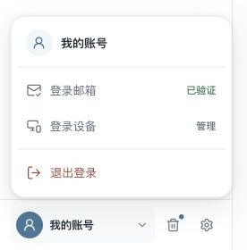

# NoteFlow 左下角账号区 · 融入侧栏提案

> 2026-10-01。原提案保留；用户已授权先实施向上弹出的账号菜单，只有这一部分进入正式页面，其余建议未实施。

## 展示范围

只重新设计现有账号、回收站和设置三个入口，不新增功能、不显示邮箱、不合并账号与通用设置。账号菜单保留登录邮箱、已登录设备、退出登录；原型只展示第一层，具体表单和设备列表继续由正式产品处理。

## 视觉建议

- 280px 局部画布，融入侧栏的暖灰背景，弱分隔线；实际侧栏宽度仍是 260px，实施时需重新校准。
- 头像从饱和蓝色改为浅蓝灰，28px；文字 13px、中等字重。
- 回收站与设置使用一致的 18px 细线图标，36px 高点击区。
- 取消“回收站非空”常驻蓝点，避免与未读通知混淆；真实数量与数据不删除。
- 账号菜单由向右侧开改为向上展开，配套使用朝上箭头；弹层不是常驻卡片。
- 按钮反馈为 160ms 颜色变化，箭头 180ms 旋转，支持减少动态效果与键盘焦点。

## 文件

- [默认小图](noteflow-account-footer.jpg)
- [展开账号菜单的小图](noteflow-account-footer-open.jpg)
- [独立预览](noteflow-account-footer.preview.html)
- [源稿](noteflow-account-footer.source.html)

## 验证与限制

已在浏览器检查默认组件为 280×92px，无横向溢出、无未替换图标；导出默认 296×108px 小图与展开 296×276px 小图。点击账号后已有三项操作可见，Escape 可关闭；浏览器 error / warn 日志为空。源稿脚本语法和 Git 差异检查另行执行。

预览仅操作本地展开状态，不调用账号接口、不触发退出登录或修改数据。正式版的表单展开、窄屏定位和深色外观仍需在实施时验证。本局部稿不替代 V10 整页候选，也不表示用户已经接受这些建议。

## 局部实施：向上弹出的账号菜单

用户通过正式页面的左下角标注明确要求先做向上弹出的部分。本轮仅调整 `src/components/AppNav.tsx` 的账号弹层及其局部样式；没有更改目录、正文、AI、回收站或通用设置布局。底栏原有头像、回收站蓝点与三个入口顺序继续保留，不把原提案的其他建议视为批准。

- 菜单位于账号区域上方，间隔 10px；桌面默认宽 248px，按容器与视口限制宽度，长内容在菜单内滚动。
- 使用 16px 圆角、轻阴影、统一细线图标与 180ms 入场动效；减少动态效果时关闭该动画。
- 原有账号标题、登录邮箱验证状态、邮箱表单、登录设备列表、退出登录及业务回调均保留。
- 账号按钮暴露展开状态与弹层关联；展开后聚焦第一项，Escape 关闭并返回账号按钮，点击外部或键盘移到外部控件时关闭；输入法组合期间 Escape 不误关。
- 色彩复用现有浅 / 深色语义变量，不引入全局主题改动。

验证：`npm run test:frontend`、`npm run test:editor-ui`、`npm run build` 通过。前端组件测试覆盖展开 / 收起、邮箱表单、设备内容、Escape 焦点、输入法、页面激活焦点、外部指针、移出焦点、退出回调、回收站 / 设置入口及紧凑模式。正式浏览器在 1280×720 与实际 `innerWidth=320, innerHeight=640` 检查第一层和邮箱 / 设备子内容，无横向溢出；收起目录后仍向上且在视口内。Enter 打开、Escape 返回焦点、点击外部关闭均实测通过。截图为真实页面整图的 276×280 局部裁剪，不含邮箱、设备地址或密钥。

限制：没有在真实账号执行验证码发送、邮箱改绑、设备撤销或退出登录；这些业务处理未改，退出回调只在测试中调用。深色配色与减少动态效果通过代码 / 样式契约检查，未做深色实机、屏幕阅读器或手机软键盘验收。V11 与自由概念图仍不作为整页实施基线。
