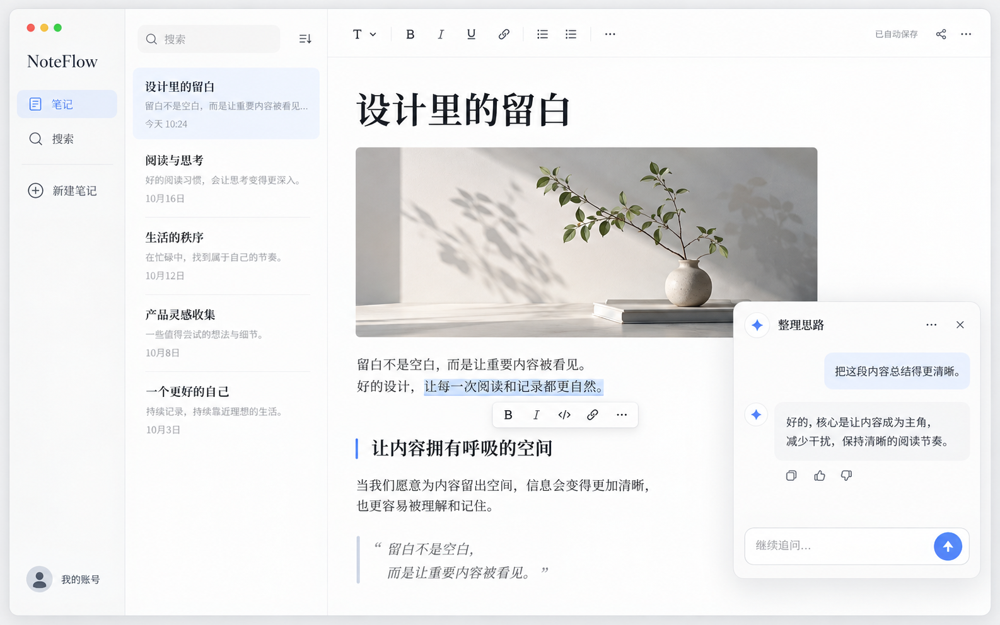

# NoteFlow · 自由审美概念

> 日期：2026-10-01。状态：审美探索，等待用户反馈；不是功能需求或实施基线。



## 本轮范围

用户明确要求快速生成一张图，完全抛开现有样式，只看设计者认为 NoteFlow 可以呈现的气质。因此本轮直接使用内置图像生成，不引用此前界面、布局或截图；只保留「笔记、阅读、写作与上下文 AI 协作」的产品定位。

正式应用、功能入口、数据和运行服务均未修改。此图不替代当前业务界面，也不恢复被退回的 V11。图中的封面、工具栏、分享入口、浮动 AI 等元素仅用于表达视觉设想；是否需要、是否可达以及如何实现，均未确认。

## 视觉方向

- 珍珠白与暖石墨文字，少量蓝紫色强调；柔和表面与浅阴影，避免厚重卡片。
- 正文像一本排版精致的电子书，标题、留白和行距成为主要视觉语言。
- 导航轻量退后，AI 以伴读浮层出现，画面不再让三块面板争夺注意力。

## 验证与限制

生成结果为 1586×992 PNG，已人工查看：完整单屏可见，阅读区、导航与 AI 区分清晰；这只是位图的视觉检查。生成式图片仍不能保证每个字、图标或坐标精确一致，不应直接作为像素级实现基准。

未制作交互原型，未验证响应式、键盘访问、真实笔记流程或动态效果，也未进行业务构建与测试，因为本轮没有代码变化。审美是否满足用户要求仍待反馈，相关 UI 问题保持未解决或部分解决。

## 生成记录

- 方式：内置图像生成工具，单次生成，无参考图片；未使用 CLI。
- 图片：`design/noteflow-free-concept-20261001.png`。
- 原始生成文件保留在工具输出目录，仓库图片为无损副本。
- 实际使用的完整提示词如下：

```text
Use case: ui-mockup.
Asset type: ONE complete desktop application concept image for NoteFlow, a personal note-writing and knowledge-reading product with contextual AI assistance.
Primary request: freely reimagine the entire visual identity from a blank canvas. The user explicitly wants to disregard every previous layout and style. Do not use or recreate any existing interface or prior conversation images. This is an aesthetic exploration, not a specification of existing features.
Style/medium: exceptionally polished, realistic high-fidelity UI design, sophisticated Apple-inspired taste and precision, soft tactile surfaces, fluid continuous corners, elegant optical balance, refined thin icons, beautiful Chinese typography. Not a wireframe, not an infographic, not a marketing landing page.
Composition/framing: single complete straight-on desktop app screen, wide 16:10 composition, all corners and bottom controls fully visible. No laptop, no monitor, no desk, no perspective, no multiple screens or annotation panels.
Design vision: an intimate, quiet knowledge atelier. A very slim graphite-on-pearl navigation rail; an airy library area with just a few elegantly typeset note titles; a generous central reading-and-writing surface with magazine-quality typography. The reading area is the clear hero. A small, beautifully integrated contextual AI companion floats near the writing area rather than a full-height equal-weight chat column. Reimagine proportions and chrome freely. Use gentle frosted pearl navigation materials, opaque readable content, shallow diffuse shadows, hairline boundaries only where necessary, a restrained blue-periwinkle interaction accent and warm graphite text. Tiny optical details feel like a crafted native desktop application, not a generic web dashboard. No pervasive glass, no large colored cards.
Subject/content: show one selected note with a short Chinese title, 2 short paragraphs, one section heading and a compact quote. A subtle selected-text highlight with a small floating formatting control. A contextual AI question, a concise answer, and a graceful message input. Include unobtrusive search, new-note and account controls. Everything serves reading, writing, finding notes or conversing with AI.
Text (verbatim where used): "NoteFlow", "笔记", "搜索", "新建笔记", "我的账号", "设计里的留白", "让内容拥有呼吸的空间", "留白不是空白，而是让重要内容被看见。", "好的设计，让每一次阅读和记录都更自然。", "整理思路", "把这段内容总结得更清晰。", "好的，核心是让内容成为主角，减少干扰，保持清晰的阅读节奏。", "继续追问…".
Typography: short, crisp, properly shaped Simplified Chinese, beautifully aligned baselines; clear, highly legible text; tasteful variable-size hierarchy and comfortable line spacing. Keep copy sparse instead of filling the screen with tiny fake paragraphs.
Avoid: current NoteFlow's old directory/editor/right-chat arrangement; generic SaaS dashboard templates; KPI cards, graphs, tasks, calendars, fabricated status badges; oversized gradient blobs; dark sci-fi styling; heavy outlines; clumsy drop shadows; gratuitous pills; rainbow icons; emoji icons; logos of Apple or other companies; gibberish text; skewed geometry; cropped edges; huge empty blank screen; promotional slogans outside the actual interface; watermarks.
Deliver a coherent, extraordinarily beautiful, calm and useful product concept, visibly fresh rather than a repaint of a conventional three-column notes app.
```
