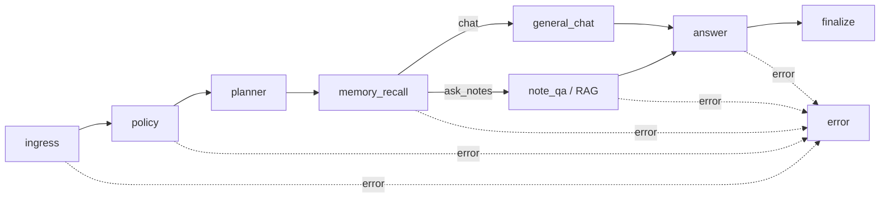

# NoteFlow LangGraph 只读图与 Shadow 架构

## 适用范围

本阶段只处理两个显式前端模式：

| 前端模式 | 图路由 | 硬约束 |
|---|---|---|
| `chat` | `general_chat` | 禁止自动搜索全库 |
| `ask_notes` | `note_qa` | 必须进入只读 RAG，必须声明来源需求 |

创建笔记、修改笔记、写长期记忆、确认/取消任务尚不进入 LangGraph；继续由 legacy 编排处理。

## 主图

- State 只包含字符串、布尔、列表和结构化字典，不包含 ORM/Session/连接对象。
- Tool 身份只来自认证后的 `user_id`，不接受模型输入的用户身份。
- RAG 复用 `LegacyRagService` 的用户作用域查询；Graph Node 不直接 SQL。
- Answer 复用现有 Chat Provider，并通过队列把 Provider token 实时映射为 `RuntimeEvent`。
- 错误统一输出 `agent_error → choices fallback → agent_done(failed) → [DONE]`。

## Checkpoint

- 隔离 PoC 入口使用官方 `AsyncPostgresSaver`。
- `thread_id` 是 PoC session/thread；`checkpoint_ns` 为空，使用官方根图命名空间。
- LangGraph 表只保存图执行状态；`agent_checkpoints` 仍是业务确认/任务状态，二者不互相读取。
- 锁定版本容器已验证 planner 后中断、关闭连接、重新连接、继续至完成。

## 隔离入口

- `POST /api/agent/langgraph-poc/chat`
- 默认 `LANGGRAPH_POC_ENABLED=false`，关闭时返回 404。
- 仅接受 `chat/ask_notes`，拥有独立 rate-limit key。
- 不创建 `agent_runs`、聊天消息或业务 Checkpoint。

## Shadow

正常 `/api/agent/chat` 仍完整执行 legacy。只有满足以下条件才调度后台 Shadow：

1. `LANGGRAPH_SHADOW_ENABLED=true`。
2. legacy intent 属于只读集合：`general_chat/note_search/note_context_qa`。
3. 用户命中 allowlist，或请求命中确定性采样比例。
4. 独立并发槽未满。

Shadow 使用 `plan_only=true`：不调用 Chat Provider，不执行 RAG、Memory、笔记或业务 Checkpoint；只运行 ingress/policy/planner 路由并记录比较结果。

`agent_shadow_runs` 只保存 query hash，不保存完整问题；记录 mode、legacy/graph intent 与归一化 route、来源需求、硬规则告警、耗时和受控错误。

### 差异规则

- `note_search/note_context_qa` 与 Graph `note_qa` 归一为同一路由。
- `chat` 图路由不是 `general_chat`：硬违规。
- `ask_notes` 图路由不是 `note_qa`，或没有 `requires_sources=true`：硬违规。
- Shadow 超时、异常、满并发均不向主请求抛出。

## 开关

| 配置 | 默认 | 作用 |
|---|---:|---|
| `LANGGRAPH_POC_ENABLED` | `false` | 开启隔离 PoC 路由 |
| `LANGGRAPH_SHADOW_ENABLED` | `false` | Shadow 总开关/快速停止 |
| `LANGGRAPH_SHADOW_SAMPLE_PERCENT` | `0` | 非 allowlist 用户的确定性采样比例 |
| `LANGGRAPH_SHADOW_USER_IDS` | 空 | 逗号分隔用户 allowlist；非空时覆盖比例 |
| `LANGGRAPH_SHADOW_TIMEOUT_MS` | `2500` | 单次 Shadow 独立超时 |
| `LANGGRAPH_SHADOW_MAX_CONCURRENCY` | `2` | 进程内 Shadow 最大并发 |

## 诊断

- `GET /api/agent/langgraph-shadow/summary`：当前认证用户的 matched/mismatched、硬违规、失败、路由一致率和平均耗时。
- `/api/metrics`：`agent.langgraph_shadow` 与 dropped/runner failure 指标。
- 硬违规写结构化 ERROR 日志；问题正文和密钥不会进入日志。
