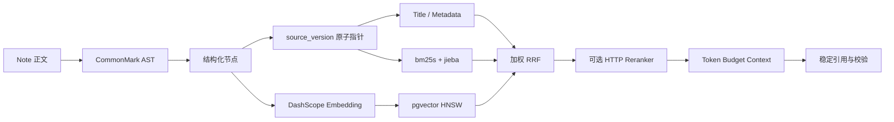

# NoteFlow RAG 架构

## 边界

RAG 是 NoteFlow 正式的数据与业务模块。LlamaIndex 提供标准 `TextNode` 适配能力，但不接管用户权限、数据库主键、索引版本或工作流。当前生产检索统一通过 `app.rag.pipeline` 执行。

## 索引数据面

- `rag_v2_index_states`：每篇笔记唯一的当前可见 `source_version` 指针和诊断状态。
- `rag_v2_nodes`：结构化节点，保存 section path、block type、content hash、parser/chunker/source 版本。
- `rag_v2_embeddings`：按 node/provider/model/dimension 唯一的向量派生记录。
- `note_index_jobs.graph_version=rag-v2`：复用已有 claim、heartbeat、重试和 stale recovery 基础设施。

上述表名保留最初上线时的 `rag_v2` 前缀，以兼容既有数据库和迁移记录；它们均为可重建的派生数据。降级 `20260717_0007 -> 20260717_0006` 只删除这三张表，不修改笔记或其他业务记录。

## AST 与分块

- `markdown-it-py` CommonMark AST 识别标题、段落、列表、引用、fenced code、HTML 和表格。
- 标题只进入 metadata 的 section path，不重复写入正文片段。
- 代码块、表格、列表、引用默认保持原子性；超过 1000 tokens 才安全拆分。
- 普通文本目标 400～800 tokens，最大 1000，overlap 60～120。
- node id 由 `note_id + section_key + chunk_index + content_hash` 计算；相同 section 内容不会因其他 section 修改而更换 ID。
- `to_llamaindex_nodes` 将存储节点映射为 LlamaIndex `TextNode`，数据库记录仍是唯一事实来源。

## 增量与并发安全

索引开始和外部 Embedding 返回后都会重新核对 `source_version`。旧任务发现正文已变化时标记 `STALE_SOURCE_VERSION/cancelled`，不能移动可见指针。新节点先以 inactive 写入；只有全部处理结束且版本仍匹配时，才在同一事务中切换 active 节点和 index state。

未变化 node 复用 ID 和现有向量；失败或过去 skipped 的向量在 Provider 恢复后可以原行重试。正常笔记保存只入队，不等待外部 Embedding。

## 权限前置检索

Title、BM25 和 Vector 三个通道均在召回前限定：

- `node.user_id = current_user`
- `state.user_id = current_user`
- `note.user_id = current_user`
- `note.deleted_at IS NULL`
- `node.active = true`
- `node.source_version = state.source_version`
- 可选当前 `note_id` scope

BM25 只对 SQL 已过滤后的节点建立内存索引；缓存 key 同时包含 user、scope、当前 node ID fingerprint 和 query。Vector SQL 再次重复相同权限条件，不能依赖融合层事后过滤。

## 融合、降级和追踪

- Title、BM25、Vector 并行运行并有独立超时。
- 单通道异常或超时只在 retrieval trace 中标记，不阻断其他通道。
- 按 note/section/content_hash 去重，使用可配置权重的 RRF；不相加不同尺度的原始分数。
- Vector 使用最低相似度门槛，BM25 要求至少一个长度不小于 2 的可见词证据，避免中文单字重合伪造来源。
- trace 包含 query normalize/rewrite、权限过滤、各通道状态/数量/延迟、rank、RRF、缓存和 Reranker 降级。

## Reranker、Context 与引用

- Reranker 是可插拔 Provider，当前实现通用 Bearer `/rerank` HTTP 协议。
- 默认关闭；成功时采用 rerank score，超时、异常、无配置或空结果立即回退 RRF。
- Context Builder 按 token budget、Top K 和每 section 最多两个节点控制上下文多样性。
- 每条来源同时有模型可用的 `[1]` 和稳定 `cite-{node_id}`，保存 note/title/section path/node/score/source version。
- 无来源时使用严格提示，禁止把通用知识伪装为用户笔记答案。
- `validate_citations` 删除不存在的引用编号，并返回 used/invalid/coverage 指标。

## 配置与回滚

默认配置：

- `RAG_RERANK_ENABLED=false`
- `RAG_BM25_ENABLED=true`
- `RAG_VECTOR_ENABLED=true`

可以分别关闭 Rewrite、BM25、Vector 和 Reranker。RAG 派生索引可以安全重建；数据库中的 `rag_v2_*` 名称仅作为兼容标识保留。

## 运维入口

- `POST /api/rag-v2/reindex`：当前用户按单篇或批量入队重建；路径为兼容旧客户端而保留。
- `GET /api/rag-v2/index-status`：查询版本、状态、节点数量和错误；路径为兼容旧客户端而保留。
- `python3 scripts/rebuild_rag.py`：管理员后台重建。
- `python3 scripts/check_rag_data.py`：只读一致性检查。
- `python3 scripts/run_rag_eval.py`：运行固定 RAG 评测。
